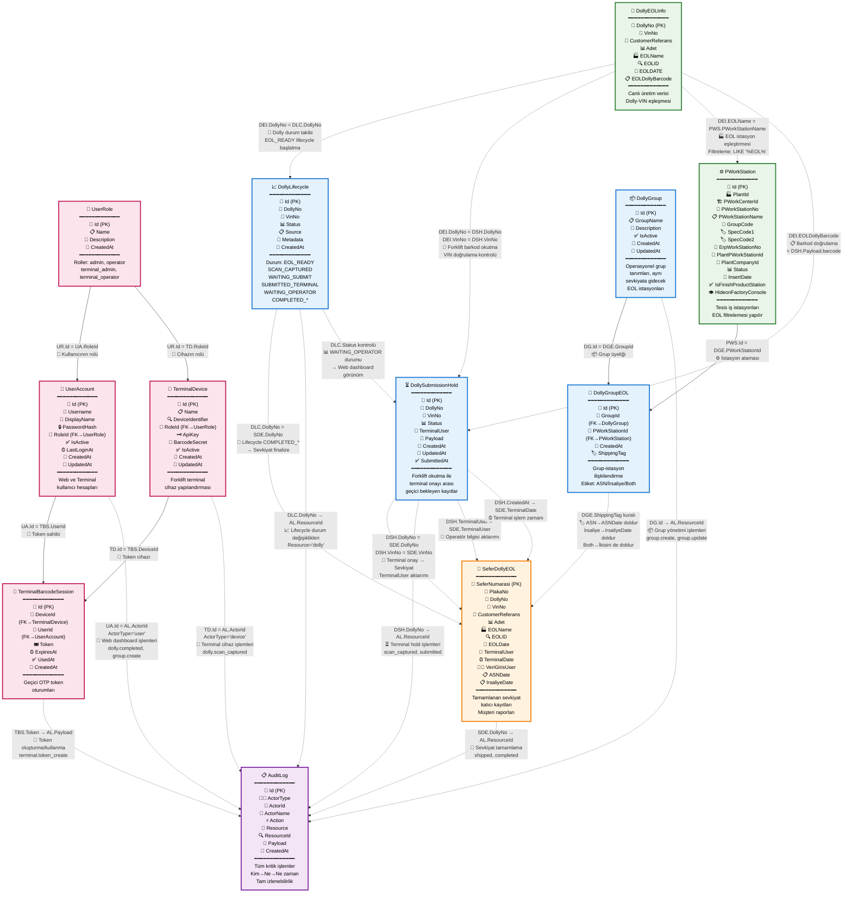

# HarmonyEcoSystem - Veritabanı Şeması ve Tablo Bağlantıları

```mermaid
graph TB
    %% GÜVENLİK KATMANI
    UR["🔐 UserRole<br/>━━━━━━━━━━━━━<br/>🔑 Id (PK)<br/>📋 Name<br/>📝 Description<br/>📅 CreatedAt<br/>━━━━━━━━━━━━━<br/>Roller: admin, operator<br/>terminal_admin, terminal_operator"]
    
    UA["👤 UserAccount<br/>━━━━━━━━━━━━━<br/>🔑 Id (PK)<br/>👥 Username<br/>🎯 DisplayName<br/>🔒 PasswordHash<br/>🔗 RoleId (FK→UserRole)<br/>✅ IsActive<br/>⏰ LastLoginAt<br/>📅 CreatedAt<br/>🔄 UpdatedAt<br/>━━━━━━━━━━━━━<br/>Web ve Terminal<br/>kullanıcı hesapları"]
    
    TD["📱 TerminalDevice<br/>━━━━━━━━━━━━━<br/>🔑 Id (PK)<br/>📋 Name<br/>🔍 DeviceIdentifier<br/>🔗 RoleId (FK→UserRole)<br/>🗝️ ApiKey<br/>🔐 BarcodeSecret<br/>✅ IsActive<br/>📅 CreatedAt<br/>🔄 UpdatedAt<br/>━━━━━━━━━━━━━<br/>Forklift terminal<br/>cihaz yapılandırması"]
    
    TBS["🎫 TerminalBarcodeSession<br/>━━━━━━━━━━━━━<br/>🔑 Id (PK)<br/>🔗 DeviceId (FK→TerminalDevice)<br/>🔗 UserId (FK→UserAccount)<br/>🎟️ Token<br/>⏰ ExpiresAt<br/>✅ UsedAt<br/>📅 CreatedAt<br/>━━━━━━━━━━━━━<br/>Geçici OTP token<br/>oturumları"]

    %% ÜRETİM KATMANI
    PWS["⚙️ PWorkStation<br/>━━━━━━━━━━━━━<br/>🔑 Id (PK)<br/>🏭 PlantId<br/>🏗️ PWorkCenterId<br/>🔢 PWorkStationNo<br/>📋 PWorkStationName<br/>📁 GroupCode<br/>🏷️ SpecCode1<br/>🏷️ SpecCode2<br/>💼 ErpWorkStationNo<br/>🔗 PlantPWorkStationId<br/>🏢 PlantCompanyId<br/>📊 Status<br/>📅 InsertDate<br/>✅ IsFinishProductStation<br/>👁️ HideonFactoryConsole<br/>━━━━━━━━━━━━━<br/>Tesis iş istasyonları<br/>EOL filtrelemesi yapılır"]
    
    DEI["🚗 DollyEOLInfo<br/>━━━━━━━━━━━━━<br/>🔑 DollyNo (PK)<br/>🚙 VinNo<br/>👥 CustomerReferans<br/>📊 Adet<br/>🏭 EOLName<br/>🔍 EOLID<br/>📅 EOLDATE<br/>📋 EOLDollyBarcode<br/>━━━━━━━━━━━━━<br/>Canlı üretim verisi<br/>Dolly-VIN eşleşmesi"]

    %% OPERASYONEL KATMAN
    DLC["📈 DollyLifecycle<br/>━━━━━━━━━━━━━<br/>🔑 Id (PK)<br/>🚗 DollyNo<br/>🚙 VinNo<br/>📊 Status<br/>📋 Source<br/>💾 Metadata<br/>📅 CreatedAt<br/>━━━━━━━━━━━━━<br/>Durum: EOL_READY<br/>SCAN_CAPTURED<br/>WAITING_SUBMIT<br/>SUBMITTED_TERMINAL<br/>WAITING_OPERATOR<br/>COMPLETED_*"]
    
    DSH["⏳ DollySubmissionHold<br/>━━━━━━━━━━━━━<br/>🔑 Id (PK)<br/>🚗 DollyNo<br/>🚙 VinNo<br/>📊 Status<br/>👤 TerminalUser<br/>💾 Payload<br/>📅 CreatedAt<br/>🔄 UpdatedAt<br/>✅ SubmittedAt<br/>━━━━━━━━━━━━━<br/>Forklift okutma ile<br/>terminal onayı arası<br/>geçici bekleyen kayıtlar"]
    
    DG["📦 DollyGroup<br/>━━━━━━━━━━━━━<br/>🔑 Id (PK)<br/>📋 GroupName<br/>📝 Description<br/>✅ IsActive<br/>📅 CreatedAt<br/>🔄 UpdatedAt<br/>━━━━━━━━━━━━━<br/>Operasyonel grup<br/>tanımları, aynı<br/>sevkiyata gidecek<br/>EOL istasyonları"]
    
    DGE["🔗 DollyGroupEOL<br/>━━━━━━━━━━━━━<br/>🔑 Id (PK)<br/>🔗 GroupId (FK→DollyGroup)<br/>🔗 PWorkStationId (FK→PWorkStation)<br/>📅 CreatedAt<br/>🏷️ ShippingTag<br/>━━━━━━━━━━━━━<br/>Grup-istasyon<br/>ilişkilendirme<br/>Etiket: ASN/İrsaliye/Both"]

    %% SEVKİYAT KATMANI
    SDE["🚚 SeferDollyEOL<br/>━━━━━━━━━━━━━<br/>🔑 SeferNumarasi (PK)<br/>🚛 PlakaNo<br/>🚗 DollyNo<br/>🚙 VinNo<br/>👥 CustomerReferans<br/>📊 Adet<br/>🏭 EOLName<br/>🔍 EOLID<br/>📅 EOLDate<br/>👤 TerminalUser<br/>⏰ TerminalDate<br/>👨‍💼 VeriGirisUser<br/>📋 ASNDate<br/>📋 IrsaliyeDate<br/>━━━━━━━━━━━━━<br/>Tamamlanan sevkiyat<br/>kalıcı kayıtları<br/>Müşteri raporları"]

    %% DENETİM KATMANI
    AL["📋 AuditLog<br/>━━━━━━━━━━━━━<br/>🔑 Id (PK)<br/>👨‍💼 ActorType<br/>🔗 ActorId<br/>👤 ActorName<br/>⚡ Action<br/>📁 Resource<br/>🔍 ResourceId<br/>💾 Payload<br/>📅 CreatedAt<br/>━━━━━━━━━━━━━<br/>Tüm kritik işlemler<br/>Kim→Ne→Ne zaman<br/>Tam izlenebilirlik"]

    %% FOREIGN KEY BAĞLANTILARI
    UR -->|"UR.Id = UA.RoleId<br/>👤 Kullanıcının rolü"| UA
    UR -->|"UR.Id = TD.RoleId<br/>📱 Cihazın rolü"| TD
    UA -->|"UA.Id = TBS.UserId<br/>👤 Token sahibi"| TBS
    TD -->|"TD.Id = TBS.DeviceId<br/>📱 Token cihazı"| TBS
    DG -->|"DG.Id = DGE.GroupId<br/>📦 Grup üyeliği"| DGE
    PWS -->|"PWS.Id = DGE.PWorkStationId<br/>⚙️ İstasyon ataması"| DGE
    
    %% LOGICAL BAĞLANTILAR - DOLLY TAKIP ZİNCİRİ
    DEI -.->|"DEI.DollyNo = DLC.DollyNo<br/>🚗 Dolly durum takibi<br/>EOL_READY lifecycle başlatma"| DLC
    DEI -.->|"DEI.DollyNo = DSH.DollyNo<br/>DEI.VinNo = DSH.VinNo<br/>🚗 Forklift barkod okutma<br/>VIN doğrulama kontrolü"| DSH
    DSH -.->|"DSH.DollyNo = SDE.DollyNo<br/>DSH.VinNo = SDE.VinNo<br/>🚗 Terminal onay → Sevkiyat<br/>TerminalUser aktarımı"| SDE
    DLC -.->|"DLC.DollyNo = SDE.DollyNo<br/>🚗 Lifecycle COMPLETED_*<br/>→ Sevkiyat finalize"| SDE
    
    %% İSTASYON EŞLEŞTİRME BAĞLANTILARI
    DEI -.->|"DEI.EOLName = PWS.PWorkStationName<br/>🏭 EOL istasyon eşleştirmesi<br/>Filtreleme: LIKE '%EOL%'"| PWS
    DGE -.->|"DGE.ShippingTag kuralı<br/>🏷️ ASN→ASNDate doldur<br/>İrsaliye→IrsaliyeDate doldur<br/>Both→İkisini de doldur"| SDE
    
    %% AUDIT İZLEME BAĞLANTILARI
    UA -.->|"UA.Id = AL.ActorId<br/>ActorType='user'<br/>👤 Web dashboard işlemleri<br/>dolly.completed, group.create"| AL
    TD -.->|"TD.Id = AL.ActorId<br/>ActorType='device'<br/>📱 Terminal cihaz işlemleri<br/>dolly.scan_captured"| AL
    DLC -.->|"DLC.DollyNo → AL.ResourceId<br/>📈 Lifecycle durum değişiklikleri<br/>Resource='dolly'"| AL
    DSH -.->|"DSH.DollyNo → AL.ResourceId<br/>⏳ Terminal hold işlemleri<br/>scan_captured, submitted"| AL
    SDE -.->|"SDE.DollyNo → AL.ResourceId<br/>🚚 Sevkiyat tamamlama<br/>shipped, completed"| AL
    DG -.->|"DG.Id → AL.ResourceId<br/>📦 Grup yönetimi işlemleri<br/>group.create, group.update"| AL
    TBS -.->|"TBS.Token → AL.Payload<br/>🎫 Token oluşturma/kullanma<br/>terminal.token_create"| AL
    
    %% ÇAPRAZ REFERANS BAĞLANTILARI
    DSH -.->|"DSH.TerminalUser = SDE.TerminalUser<br/>👤 Operatör bilgisi aktarımı"| SDE
    DSH -.->|"DSH.CreatedAt → SDE.TerminalDate<br/>⏰ Terminal işlem zamanı"| SDE
    DLC -.->|"DLC.Status kontrolü<br/>📊 WAITING_OPERATOR durumu<br/>→ Web dashboard görünüm"| DSH
    DEI -.->|"DEI.EOLDollyBarcode<br/>📋 Barkod doğrulama<br/>= DSH.Payload.barcode"| DSH
    
    %% STİL TANIMLARI
    classDef security fill:#fce4ec,stroke:#c2185b,stroke-width:3px,color:#000
    classDef production fill:#e8f5e8,stroke:#2e7d32,stroke-width:3px,color:#000
    classDef operational fill:#e3f2fd,stroke:#1976d2,stroke-width:3px,color:#000
    classDef shipment fill:#fff3e0,stroke:#f57c00,stroke-width:3px,color:#000
    classDef audit fill:#f3e5f5,stroke:#7b1fa2,stroke-width:3px,color:#000
    
    class UR,UA,TD,TBS security
    class PWS,DEI production
    class DLC,DSH,DG,DGE operational
    class SDE shipment
    class AL audit
```