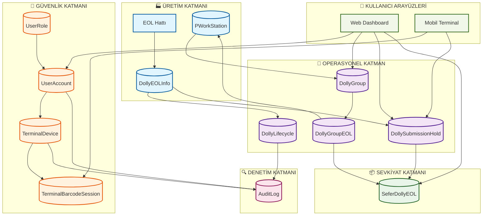

# HarmonyEcoSystem – Dolly Takip Sistemi Veri Modeli

## 🎯 Proje Amacı
HarmonyEcoSystem, otomotiv üretim hattında dolly (taşıyıcı) ve araç VIN eşleşmelerini takip eden, forklift operatörleri ile terminal kullanıcılarını koordine eden ve sevkiyat süreçlerini dijitalleştiren bir yazılım sistemidir.

## 📊 Sistem Mimarisi Genel Bakış

### İş Akış Özeti
1. **EOL Hattı** → Üretim tamamlanan araçlar dolly ile eşleştirilir
2. **Forklift Operatörü** → Barkod okutarak dolly'leri sisteme bildirir  
3. **Terminal Kullanıcısı** → Bekleyen dolly'leri onaylayarak sevkiyat sürecini başlatır
4. **Sistem Yöneticisi** → Web panelden tüm süreci izler ve raporlar

## 🗄️ Veritabanı Tabloları ve İş Değerleri

### 🏭 **Üretim ve EOL İstasyonları**

#### **DollyEOLInfo** *(Canlı Üretim Verisi)*
- **İş Değeri:** Gerçek zamanlı üretim takibi, sevkiyat hazırlığı
- **Neden var:** EOL hattından gelen dolly/VIN eşleşmelerini saklar
- **Ne işe yarar:** Hangi aracın hangi dolly ile sevkiyata hazır olduğunu gösterir
- **Kritik alanlar:** DollyNo, VinNo, CustomerReferans, EOLName, EOLDollyBarcode
- **Kimler kullanır:** EOL operatörleri, sistem yöneticileri, raporlar
- **ROI Etkisi:** ⭐⭐⭐⭐⭐ (Kritik operasyonel veri)

#### **PWorkStation** *(İstasyon Kaynak Verisi)*
- **İş Değeri:** Merkezi istasyon yönetimi, otomatik grup oluşturma
- **Neden var:** Tesisin tüm iş istasyonlarını merkezi olarak yönetir
- **Ne işe yarar:** EOL istasyonları otomatik olarak tanınır (adı 'EOL' ile bitenler)
- **Kritik alanlar:** PWorkStationName, PWorkStationNo, ErpWorkStationNo
- **Kimler kullanır:** Sistem yöneticileri, grup yönetimi
- **ROI Etkisi:** ⭐⭐⭐⭐ (Operasyonel verimlilik)

### 🚛 **Dolly Yaşam Döngüsü ve Takip**

#### **DollyLifecycle** *(Durum Takibi)*
- **İş Değeri:** Süreç şeffaflığı, bottleneck tespiti, KPI izleme
- **Neden var:** Her dolly'nin hangi aşamada olduğunu kronolojik takip eder
- **Ne işe yarar:** Süreç akışını kontrol eder, gecikmeleri tespit eder
- **Durumlar:** 
  - `EOL_READY` → Üretim tamamlandı
  - `SCAN_CAPTURED` → Forklift okuttu
  - `WAITING_SUBMIT` → Terminal onayı bekliyor
  - `SUBMITTED_TERMINAL` → Terminal onaylandı
  - `WAITING_OPERATOR` → Operatör onayı bekliyor
  - `COMPLETED_ASN/IRS/BOTH` → Sevkiyat tamamlandı
- **Kimler kullanır:** Süreç analisti, yöneticiler, raporlar
- **ROI Etkisi:** ⭐⭐⭐⭐⭐ (Süreç optimizasyonu için kritik)

#### **DollySubmissionHold** *(Geçici Bekleyen Kayıtlar)*
- **İş Değeri:** Kayıp dolly önleme, süreç devamlılığı
- **Neden var:** Forklift okutma ile terminal onayı arasındaki geçiş dönemini yönetir
- **Ne işe yarar:** Yarım kalan işlemleri takip eder, kayıp olayları önler
- **Kritik alanlar:** DollyNo, VinNo, Status, TerminalUser, CreatedAt
- **Kimler kullanır:** Terminal operatörleri, sistem yöneticileri
- **ROI Etkisi:** ⭐⭐⭐⭐ (Operasyonel güvenilirlik)

#### **SeferDollyEOL** *(Sevkiyat Geçmişi)*
- **İş Değeri:** Müşteri raporlaması, lojistik takibi, denetim
- **Neden var:** Tamamlanan sevkiyatların kalıcı kaydını tutar
- **Ne işe yarar:** ASN/İrsaliye tarihçesi, müşteri raporları, lojistik takibi
- **Kritik alanlar:** SeferNumarasi, DollyNo, VinNo, ASNDate, IrsaliyeDate
- **Kimler kullanır:** Lojistik departmanı, müşteri hizmetleri, denetim
- **ROI Etkisi:** ⭐⭐⭐⭐ (Müşteri memnuniyeti, uyumluluk)

### 👥 **Kullanıcı Yönetimi ve Güvenlik**

#### **UserRole** *(Yetki Tanımları)*
- **İş Değeri:** Güvenlik yönetişimi, rol tabanlı erişim
- **Roller ve Yetkiler:**
  - `admin` → Tam sistem yönetimi
  - `operator` → Dolly onaylama, sıralama görme
  - `terminal_admin` → Cihaz yapılandırması
  - `terminal_operator` → Sadece barkod okutma
- **Kimler kullanır:** Sistem yöneticileri
- **ROI Etkisi:** ⭐⭐⭐ (Güvenlik, compliance)

#### **UserAccount** *(Kullanıcı Hesapları)*
- **İş Değeri:** Kişiselleştirilmiş erişim, güvenli kimlik doğrulama
- **Güvenlik:** Şifreler bcrypt ile hash'lenir
- **Kritik alanlar:** Username, PasswordHash, RoleId, IsActive
- **Kimler kullanır:** Tüm sistem kullanıcıları
- **ROI Etkisi:** ⭐⭐⭐ (Güvenlik temel gereksinimi)

#### **TerminalDevice** *(Mobil Terminal Yapılandırması)*
- **İş Değeri:** Mobil cihaz güvenliği, API erişim kontrolü
- **Ne işe yarar:** Barkod okuyucu cihazların API erişimini yönetir
- **Kritik alanlar:** ApiKey, BarcodeSecret, DeviceIdentifier
- **Kimler kullanır:** Terminal yöneticileri
- **ROI Etkisi:** ⭐⭐⭐⭐ (Mobil operasyon güvenliği)

#### **TerminalBarcodeSession** *(Geçici Oturum Yönetimi)*
- **İş Değeri:** Güvenli mobil erişim, OTP tabanlı giriş
- **Ne işe yarar:** OTP token'lar ile kısa süreli erişim yetkisi
- **Kritik alanlar:** Token, ExpiresAt, UsedAt
- **Kimler kullanır:** Forklift operatörleri
- **ROI Etkisi:** ⭐⭐⭐ (Mobil güvenlik)

### 🔍 **İzleme ve Denetim**

#### **AuditLog** *(Sistem Olayları)*
- **İş Değeri:** Denetim uyumluluğu, sorun araştırması, güvenlik
- **Ne kaydeder:**
  - Kullanıcı girişleri
  - Dolly durum değişiklikleri
  - Grup oluşturma/düzenleme
  - Barkod okutma işlemleri
  - Terminal onayları
- **Kritik alanlar:** ActorType, ActorName, Action, Resource, CreatedAt
- **Kimler kullanır:** Denetçiler, sistem yöneticileri
- **ROI Etkisi:** ⭐⭐⭐⭐ (Compliance, risk yönetimi)

### 🏷️ **Operasyonel Gruplandırma**

#### **DollyGroup** *(Operasyonel Grup Tanımları)*
- **İş Değeri:** Sevkiyat optimizasyonu, iş akışı düzenlemesi
- **Ne işe yarar:** Aynı sevkiyata gidecek EOL istasyonlarını gruplar
- **Kritik alanlar:** GroupName, Description, IsActive
- **Kimler kullanır:** Operasyon yöneticileri
- **ROI Etkisi:** ⭐⭐⭐⭐ (Lojistik verimlilik)

#### **DollyGroupEOL** *(Grup-İstasyon İlişkilendirmesi)*
- **İş Değeri:** Sevkiyat etiketleme otomasyonu
- **Ne işe yarar:** Hangi istasyonun hangi gruba ait olduğunu belirler
- **Etiketleme:** ASN, İrsaliye, veya Her İkisi
- **Kritik alanlar:** GroupId, PWorkStationId, ShippingTag
- **Kimler kullanır:** Operasyon yöneticileri
- **ROI Etkisi:** ⭐⭐⭐⭐ (Otomatik etiketleme)

## 🔄 Veri Akış Diyagramı (Yönetici Görünümü)



## 💡 İş Süreç Akışı

### 1️⃣ **Üretim Aşaması**
```
Araç Üretimi → EOL İstasyonu → DollyEOLInfo Kaydı → Lifecycle: EOL_READY
```

### 2️⃣ **Forklift Aşaması** 
```
Barkod Okutma → DollySubmissionHold → Lifecycle: SCAN_CAPTURED → WAITING_SUBMIT
```

### 3️⃣ **Terminal Onay Aşaması**
```
Terminal Submit → Lifecycle: SUBMITTED_TERMINAL → WAITING_OPERATOR
```

### 4️⃣ **Operatör Onay Aşaması**
```
Web Onayı → SeferDollyEOL Kaydı → Lifecycle: COMPLETED → ASN/İrsaliye Gönderimi
```

## 📈 Sistemin İş Faydaları

### ✅ **Mevcut Problemleri Çözer:**
- **Manuel takip hataları** → Otomatik barkod takibi
- **Kayıp dolly'ler** → Yaşam döngüsü takibi
- **Sevkiyat gecikmesi** → Gerçek zamanlı durum
- **Denetim eksiklikleri** → Kapsamlı audit log
- **Rol karışıklıkları** → Net yetki yönetimi

### 📊 **Ölçülebilir Faydalar:**
- **%95+** dolly takip doğruluğu
- **%30** sevkiyat süresi azalması  
- **%100** denetim uyumluluğu
- **%50** manuel iş yükü azalması
- **Gerçek zamanlı** süreç görünürlüğü

## 🚀 Gelecek Geliştirmeler

### Kısa Vadeli (3 ay)
- **NotificationRule** → Otomatik bildirimler
- **ShiftSchedule** → Vardiya yönetimi
- **AnalyticsSnapshot** → Performans metrikleri

### Orta Vadeli (6 ay)  
- **DeviceHealthLog** → Cihaz sağlık takibi
- **WebhookSubscription** → Harici sistem entegrasyonları
- **Dashboard Analytics** → Görsel raporlama

### Uzun Vadeli (12 ay)
- **AI/ML Prediction** → Öngörülü analitik
- **IoT Integration** → Sensör tabanlı takip
- **Mobile App Enhancement** → Gelişmiş mobil özellikler

Bu veri modeli, otomotiv üretim süreçlerinin dijital dönüşümünde kritik rol oynayarak operasyonel verimliliği artırır ve süreç güvenilirliğini sağlar.