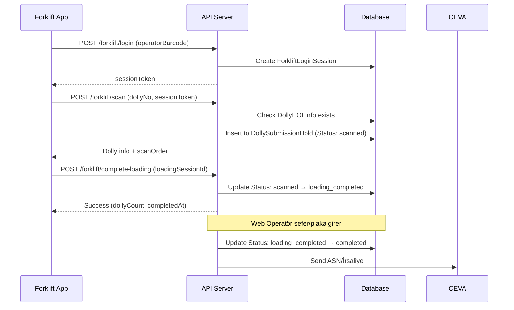

# 📱 Android Forklift Uygulaması - Kapsamlı Entegrasyon Rehberi

## 📋 İçindekiler
1. [Genel Bakış](#genel-bakış)
2. [Sistem Mimarisi](#sistem-mimarisi)
3. [Authentication (Kimlik Doğrulama)](#authentication)
4. [Forklift İşlemleri (Dolly Yükleme)](#forklift-işlemleri)
5. [Manuel Toplama (Manual Collection)](#manuel-toplama)
6. [Veri Modelleri](#veri-modelleri)
7. [Ekran Tasarımları ve UI Gereksinimleri](#ekran-tasarımları)
8. [Hata Yönetimi](#hata-yönetimi)
9. [Örnek Kotlin Kodları](#örnek-kotlin-kodları)

---

## 🎯 Genel Bakış

### Sistem Açıklaması
HarmonyEcoSystem, forklift operatörlerinin dolly'leri (arabaları) TIR'a yüklerken kullandığı bir mobil uygulama ve web yönetim sistemidir.

### İş Akışı
```
1. Forklift Operatörü → Barkod ile giriş yapar
2. Dolly'leri sırayla okutarak TIR'a yükler
3. Yükleme tamamlandığında "Complete" butonuna basar
4. Web Operatör → Sefer No, Plaka girip sevkiyatı tamamlar
5. Sistem → CEVA API'sine ASN/İrsaliye gönderir
```

### API Base URL
```
Production: http://10.25.1.174:8181/api
```

### Teknoloji Stack Önerileri
- **Network:** Retrofit2 + OkHttp3
- **JSON:** Gson / Kotlinx Serialization
- **Async:** Coroutines + Flow
- **Storage:** Room Database (offline cache)
- **Barcode:** ZXing / ML Kit

---

## 🏗️ Sistem Mimarisi

### Backend Modelleri (Anlamanız Gereken Temel Kavramlar)

#### 1. DollyEOLInfo (Üretim Hattından Gelen Dolly Bilgileri)
```sql
-- Dolly'ler üretim hattından (EOL) gelir
DollyNo: "5170427"              -- Dolly numarası
VinNo: "VIN001\nVIN002\nVIN003" -- Birden fazla VIN olabilir (\n ile ayrılmış)
CustomerReferans: "CUST123"      -- Müşteri referansı
EOLName: "V710-MR-EOL"          -- Hangi üretim hattından geldi
EOLID: "42"                      -- Üretim hattı ID
Adet: 3                          -- Kaç parça var
EOLDollyBarcode: "BARCODE123"    -- Dolly üzerindeki fiziksel barkod
```

#### 2. DollySubmissionHold (Forklift Tarafından Taranan Dolly'ler)
```sql
-- Forklift operatörü dolly'yi okuttuğunda buraya kaydedilir
DollyNo: "5170427"
VinNo: "VIN001"                  -- Her VIN için ayrı kayıt
Status: "scanned"                -- scanned → loading_completed → completed
LoadingSessionId: "LOAD_20251214_MEHMET"  -- Aynı yükleme seansı
ScanOrder: 1                     -- 1, 2, 3... sırayla yükleme
TerminalUser: "MEHMET"           -- Operatör adı
PartNumber: "PART-20251214-ABC"  -- Grup tanımlayıcı
SeferNumarasi: "SFR001"          -- Sefer numarası (web operatör girer)
PlakaNo: "34 ABC 123"            -- Plaka (web operatör girer)
CreatedAt, UpdatedAt, SubmittedAt, CompletedAt
```

#### 3. ForkliftLoginSession (Operatör Oturumları)
```sql
-- Operatör giriş yaptığında oluşturulan oturum
SessionToken: "eyJhbGc..."       -- JWT token (Authorization header'da kullanılır)
OperatorBarcode: "EMP12345"      -- Operatör barkodu
OperatorName: "Mehmet Yılmaz"    -- Operatör adı
LoginAt: "2025-12-14T08:00:00Z"
ExpiresAt: "2025-12-14T16:00:00Z"  -- 8 saat geçerli
IsActive: true
```

### Workflow Detayları

#### 🔄 Forklift Yükleme Akışı (Temel İşlem)


---

## 🔐 Authentication (Kimlik Doğrulama)

### 1. Login - Barkod ile Giriş

**Endpoint:**
```http
POST /api/forklift/login
Content-Type: application/json
```

**Request Body:**
```json
{
  "operatorBarcode": "EMP12345",
  "operatorName": "Mehmet Yılmaz",  // Optional
  "deviceId": "android-serial-123456"  // Optional (önerilir)
}
```

**Success Response (200 OK):**
```json
{
  "success": true,
  "sessionToken": "eyJhbGciOiJIUzI1NiIsInR5cCI6IkpXVCJ9...",
  "operatorName": "Mehmet Yılmaz",
  "operatorBarcode": "EMP12345",
  "expiresAt": "2025-12-14T16:00:00Z",
  "message": "Hoş geldiniz Mehmet Yılmaz",
  "isAdmin": false,
  "role": "forklift"
}
```

**Admin Response Example:**
```json
{
  "success": true,
  "sessionToken": "eyJhbGciOiJIUzI1NiIsInR5cCI6IkpXVCJ9...",
  "operatorName": "Admin User",
  "operatorBarcode": "ADMIN001",
  "expiresAt": "2025-12-14T16:00:00Z",
  "message": "Hoş geldiniz Admin User",
  "isAdmin": true,
  "role": "admin"
}
```

**Error Responses:**
```json
// 400 Bad Request - Barkod eksik
{
  "success": false,
  "message": "Operatör barkodu gerekli"
}

// 500 Internal Server Error
{
  "success": false,
  "message": "Giriş yapılamadı. Lütfen tekrar deneyin."
}
```

**Kotlin Örnek:**
```kotlin
data class LoginRequest(
    val operatorBarcode: String,
    val operatorName: String? = null,
    val deviceId: String? = null
)

data class LoginResponse(
    val success: Boolean,
    val sessionToken: String? = null,
    val operatorName: String? = null,
    val operatorBarcode: String? = null,
    val expiresAt: String? = null,
    val message: String,
    val isAdmin: Boolean = false,
    val role: String? = "forklift"
)

interface ForkliftApi {
    @POST("forklift/login")
    suspend fun login(@Body request: LoginRequest): Response<LoginResponse>
}

// Kullanım
suspend fun loginOperator(barcode: String): Result<LoginResponse> {
    return try {
        val deviceId = Settings.Secure.getString(
            context.contentResolver, 
            Settings.Secure.ANDROID_ID
        )
        
        val response = api.login(LoginRequest(
            operatorBarcode = barcode,
            deviceId = deviceId
        ))
        
        if (response.isSuccessful && response.body()?.success == true) {
            // Token'ı sakla
            saveToken(response.body()!!.sessionToken!!)
            Result.success(response.body()!!)
        } else {
            Result.failure(Exception(response.body()?.message ?: "Giriş başarısız"))
        }
    } catch (e: Exception) {
        Result.failure(e)
    }
}
```

### 2. Session Validation - Oturum Doğrulama

**Endpoint:**
```http
GET /api/forklift/session/validate
Authorization: Bearer <sessionToken>
```

**Success Response (200 OK):**
```json
{
  "valid": true,
  "operatorName": "Mehmet Yılmaz",
  "operatorBarcode": "EMP12345",
  "loginAt": "2025-12-14T08:00:00Z",
  "expiresAt": "2025-12-14T16:00:00Z"
}
```

**Error Response (401 Unauthorized):**
```json
{
  "error": "Oturum geçersiz veya süresi dolmuş"
}
```

**Kotlin Örnek:**
```kotlin
@GET("forklift/session/validate")
suspend fun validateSession(
    @Header("Authorization") token: String
): Response<SessionValidationResponse>

// Her uygulama açılışında kontrol et
suspend fun checkSession() {
    val token = getStoredToken() ?: return
    
    try {
        val response = api.validateSession("Bearer $token")
        if (!response.isSuccessful || response.body()?.valid != true) {
            // Token geçersiz, login ekranına yönlendir
            clearToken()
            navigateToLogin()
        }
    } catch (e: Exception) {
        // Network hatası, offline mod?
    }
}
```

### 3. Logout - Çıkış

**Endpoint:**
```http
POST /api/forklift/logout
Authorization: Bearer <sessionToken>
```

**Success Response (200 OK):**
```json
{
  "success": true,
  "message": "Çıkış yapıldı. Güle güle!"
}
```

---

## 🚛 Forklift İşlemleri (Dolly Yükleme)

### 1. Scan Dolly - Dolly Barkod Okutma

**Endpoint:**
```http
POST /api/forklift/scan
Authorization: Bearer <sessionToken>
Content-Type: application/json
```

**Request Body:**
```json
{
  "dollyNo": "5170427",
  "loadingSessionId": "LOAD_20251214_MEHMET",  // Optional - ilk seferinde otomatik oluşur
  "barcode": "BARCODE123"  // Optional - doğrulama için
}
```

**Success Response (201 Created):**
```json
{
  "id": 42,
  "dolly_no": "5170427",
  "vin_no": "VIN001",
  "status": "scanned",
  "terminal_user": "MEHMET",
  "part_number": "PART-20251214-ABC",
  "scanned_at": "2025-12-14T10:30:00Z",
  "submitted_at": null,
  "payload": {},
  "barcode": "BARCODE123",
  "customer_referans": "CUST123",
  "adet": 3,
  "eol_name": "V710-MR-EOL",
  "eol_id": "42",
  "eol_date": "2025-12-14",
  "eol_dolly_barcode": "BARCODE123",
  "vin_breakdown": []
}
```

**Error Responses:**
```json
// 400 Bad Request - Dolly numarası eksik
{
  "error": "dollyNo is required",
  "retryable": true
}

// 400 Bad Request - Dolly bulunamadı
{
  "error": "Dolly 5170427 sistemde bulunamadı",
  "retryable": true
}

// 400 Bad Request - Dolly zaten taranmış
{
  "error": "Bu dolly zaten taranmış",
  "retryable": true
}

// 500 Internal Server Error
{
  "error": "Beklenmeyen hata",
  "message": "Database connection failed",
  "retryable": false
}
```

**Kotlin Örnek:**
```kotlin
data class ScanDollyRequest(
    val dollyNo: String,
    val loadingSessionId: String? = null,
    val barcode: String? = null
)

data class DollyHoldEntry(
    val id: Int?,
    val dolly_no: String,
    val vin_no: String,
    val status: String,
    val terminal_user: String?,
    val part_number: String?,
    val scanned_at: String?,
    val submitted_at: String?,
    val customer_referans: String?,
    val adet: Int?,
    val eol_name: String?,
    val eol_id: String?,
    val eol_date: String?,
    val eol_dolly_barcode: String?
)

@POST("forklift/scan")
suspend fun scanDolly(
    @Header("Authorization") token: String,
    @Body request: ScanDollyRequest
): Response<DollyHoldEntry>

// Kullanım
suspend fun scanDollyBarcode(dollyNo: String): Result<DollyHoldEntry> {
    return try {
        val response = api.scanDolly(
            token = "Bearer ${getToken()}",
            request = ScanDollyRequest(
                dollyNo = dollyNo,
                loadingSessionId = currentLoadingSessionId
            )
        )
        
        if (response.isSuccessful) {
            val entry = response.body()!!
            
            // Loading session ID'yi sakla (ilk taramada oluşur)
            if (currentLoadingSessionId == null) {
                // Backend'den dönen entry'de loadingSessionId yok,
                // ama PartNumber var - onu kullanabiliriz
                currentLoadingSessionId = entry.part_number
            }
            
            // UI'da göster
            addDollyToList(entry)
            Result.success(entry)
        } else {
            val errorBody = response.errorBody()?.string()
            // Parse error
            Result.failure(Exception(errorBody ?: "Scan failed"))
        }
    } catch (e: Exception) {
        Result.failure(e)
    }
}
```

### 2. Remove Last Dolly - Son Taranan Dolly'yi Çıkar

**ÖNEMLİ:** LIFO (Last In First Out) mantığıyla çalışır. Sadece en son taranan dolly çıkartılabilir.

**Endpoint:**
```http
POST /api/forklift/remove-last
Authorization: Bearer <sessionToken>
Content-Type: application/json
```

**Request Body:**
```json
{
  "loadingSessionId": "LOAD_20251214_MEHMET",
  "dollyBarcode": "BARCODE123"  // Doğrulama için
}
```

**Success Response (200 OK):**
```json
{
  "dollyNo": "5170427",
  "vinNo": "VIN001",
  "scanOrder": 15,
  "removedAt": "2025-12-14T10:45:00Z"
}
```

**Error Responses:**
```json
// 400 Bad Request - Session ID eksik
{
  "error": "loadingSessionId is required",
  "retryable": true
}

// 400 Bad Request - Barkod eksik
{
  "error": "dollyBarcode is required",
  "retryable": true
}

// 400 Bad Request - Dolly bulunamadı veya son taranma değil
{
  "error": "Son taranan dolly değil veya bulunamadı",
  "retryable": true
}
```

### 3. Complete Loading - Yüklemeyi Tamamla

**Endpoint:**
```http
POST /api/forklift/complete-loading
Authorization: Bearer <sessionToken>
Content-Type: application/json
```

**Request Body:**
```json
{
  "loadingSessionId": "LOAD_20251214_MEHMET"
}
```

**Success Response (200 OK):**
```json
{
  "loadingSessionId": "LOAD_20251214_MEHMET",
  "dollyCount": 15,
  "completedAt": "2025-12-14T11:00:00Z",
  "status": "loading_completed"
}
```

**Error Responses:**
```json
// 400 Bad Request - Session ID eksik
{
  "error": "loadingSessionId is required",
  "retryable": true
}

// 400 Bad Request - Dolly yok
{
  "error": "Bu session'da hiç dolly taranmamış",
  "retryable": true
}

// 400 Bad Request - Zaten tamamlanmış
{
  "error": "Bu yükleme zaten tamamlanmış",
  "retryable": true
}
```

### 4. List Sessions - Yükleme Oturumlarını Listele

**Endpoint:**
```http
GET /api/forklift/sessions?status=scanned
Authorization: Bearer <sessionToken>
```

**Query Parameters:**
- `status` (optional): `scanned`, `loading_completed`, `completed`

**Success Response (200 OK):**
```json
[
  {
    "loadingSessionId": "LOAD_20251214_MEHMET",
    "dollyCount": 15,
    "status": "loading_completed",
    "createdAt": "2025-12-14T08:30:00Z",
    "completedAt": "2025-12-14T11:00:00Z"
  },
  {
    "loadingSessionId": "LOAD_20251213_MEHMET",
    "dollyCount": 20,
    "status": "completed",
    "createdAt": "2025-12-13T08:30:00Z",
    "completedAt": "2025-12-13T12:00:00Z"
  }
]
```

---

## 📦 Manuel Toplama (Manual Collection)

### İş Akışı
Manuel toplama, operatörün belirli bir EOL grubundaki dolly'leri seçerek toplamasıdır.

```
1. GET /manual-collection/groups → Tüm EOL gruplarını listele
2. GET /manual-collection/groups/{groupName} → Grup içindeki dolly'leri listele
3. POST /manual-collection/scan → Dolly barkod okut
4. POST /manual-collection/remove-last → Son okutulan dolly'yi çıkar
```

### 1. Get Groups - EOL Gruplarını Listele

**Endpoint:**
```http
GET /api/manual-collection/groups
Authorization: Bearer <sessionToken>
```

**Success Response (200 OK):**
```json
[
  {
    "group_name": "V710-MR-EOL",
    "dolly_count": 8,
    "scanned_count": 3
  },
  {
    "group_name": "V720-FR-EOL",
    "dolly_count": 5,
    "scanned_count": 0
  }
]
```

**UI Tasarımı:**
```
┌─────────────────────────────────┐
│  Manuel Toplama - Grup Seçimi   │
├─────────────────────────────────┤
│                                 │
│  📦 V710-MR-EOL                 │
│     8 dolly (3 tarandı)         │
│     [Seç >]                     │
│                                 │
│  📦 V720-FR-EOL                 │
│     5 dolly (0 tarandı)         │
│     [Seç >]                     │
│                                 │
└─────────────────────────────────┘
```

### 2. Get Group Dollys - Grup Dolly'lerini Listele

**Endpoint:**
```http
GET /api/manual-collection/groups/{group_name}
Authorization: Bearer <sessionToken>
```

**Success Response (200 OK):**
```json
{
  "group_name": "V710-MR-EOL",
  "dollys": [
    {
      "dolly_no": "5170427",
      "vin_no": "VIN001\nVIN002\nVIN003",
      "scanned": false
    },
    {
      "dolly_no": "5170428",
      "vin_no": "VIN004\nVIN005",
      "scanned": true
    }
  ]
}
```

**Error Response (404 Not Found):**
```json
{
  "error": "Grup 'V710-MR-EOL' bulunamadı veya dolly yok",
  "retryable": true
}
```

**UI Tasarımı:**
```
┌─────────────────────────────────┐
│  V710-MR-EOL                    │
│  5 dolly (2 tarandı)            │
├─────────────────────────────────┤
│                                 │
│  [ ] 5170427                    │
│      VIN001, VIN002, VIN003     │
│                                 │
│  [✓] 5170428 ✅                 │
│      VIN004, VIN005             │
│                                 │
│  [ ] 5170429                    │
│      VIN006                     │
│                                 │
├─────────────────────────────────┤
│  [Tara] [Geri Al] [Tamamla]    │
└─────────────────────────────────┘
```

### 3. Scan Dolly - Manuel Dolly Tarama

**Endpoint:**
```http
POST /api/manual-collection/scan
Authorization: Bearer <sessionToken>
Content-Type: application/json
```

**Request Body:**
```json
{
  "group_name": "V710-MR-EOL",
  "barcode": "5170427"  // veya EOLDollyBarcode
}
```

**Success Response (200 OK):**
```json
{
  "success": true,
  "dolly_no": "5170427",
  "message": "Dolly eklendi"
}
```

**Error Responses:**
```json
// 400 Bad Request - Parametre eksik
{
  "error": "group_name ve barcode gerekli",
  "retryable": true
}

// 404 Not Found - Barkod bulunamadı
{
  "error": "Barkod '5170427' sistemde bulunamadı",
  "retryable": true
}

// 400 Bad Request - Yanlış grup
{
  "error": "Bu dolly 'V720-FR-EOL' grubuna ait, 'V710-MR-EOL' değil",
  "retryable": true
}

// 400 Bad Request - Zaten taranmış
{
  "error": "Bu dolly zaten taranmış",
  "retryable": true
}
```

### 4. Remove Last - Son Dolly'yi Çıkar

**Endpoint:**
```http
POST /api/manual-collection/remove-last
Authorization: Bearer <sessionToken>
Content-Type: application/json
```

**Request Body:**
```json
{
  "group_name": "V710-MR-EOL",
  "barcode": "5170428"
}
```

**Success Response (200 OK):**
```json
{
  "success": true,
  "dolly_no": "5170428",
  "message": "Dolly çıkartıldı"
}
```

**Error Responses:**
```json
// 400 Bad Request - Dolly taranmamış
{
  "error": "Bu dolly taranmamış",
  "retryable": true
}
```

---

## 📊 Veri Modelleri

### Kotlin Data Classes

```kotlin
// ============ Authentication Models ============

data class LoginRequest(
    val operatorBarcode: String,
    val operatorName: String? = null,
    val deviceId: String? = null
)

data class LoginResponse(
    val success: Boolean,
    val sessionToken: String? = null,
    val operatorName: String? = null,
    val operatorBarcode: String? = null,
    val expiresAt: String? = null,  // ISO 8601
    val message: String
)

data class SessionValidationResponse(
    val valid: Boolean,
    val operatorName: String? = null,
    val operatorBarcode: String? = null,
    val loginAt: String? = null,
    val expiresAt: String? = null
)

// ============ Forklift Operations Models ============

data class ScanDollyRequest(
    val dollyNo: String,
    val loadingSessionId: String? = null,
    val barcode: String? = null
)

data class DollyHoldEntry(
    val id: Int?,
    val dolly_no: String,
    val vin_no: String,
    val status: String,  // scanned, loading_completed, completed
    val terminal_user: String?,
    val part_number: String?,
    val scanned_at: String?,  // ISO 8601
    val submitted_at: String?,
    val customer_referans: String?,
    val adet: Int?,
    val eol_name: String?,
    val eol_id: String?,
    val eol_date: String?,  // YYYY-MM-DD
    val eol_dolly_barcode: String?
)

data class RemoveLastDollyRequest(
    val loadingSessionId: String,
    val dollyBarcode: String
)

data class RemoveLastDollyResponse(
    val dollyNo: String,
    val vinNo: String,
    val scanOrder: Int,
    val removedAt: String
)

data class CompleteLoadingRequest(
    val loadingSessionId: String
)

data class CompleteLoadingResponse(
    val loadingSessionId: String,
    val dollyCount: Int,
    val completedAt: String,
    val status: String
)

data class LoadingSession(
    val loadingSessionId: String,
    val dollyCount: Int,
    val status: String,
    val createdAt: String,
    val completedAt: String?
)

// ============ Manual Collection Models ============

data class EOLGroup(
    val group_name: String,
    val dolly_count: Int,
    val scanned_count: Int
)

data class GroupDolly(
    val dolly_no: String,
    val vin_no: String,
    val scanned: Boolean
)

data class GroupDollysResponse(
    val group_name: String,
    val dollys: List<GroupDolly>
)

data class ManualScanRequest(
    val group_name: String,
    val barcode: String
)

data class ManualScanResponse(
    val success: Boolean,
    val dolly_no: String,
    val message: String
)

// ============ Error Models ============

data class ApiError(
    val error: String,
    val message: String? = null,
    val retryable: Boolean = true
)
```

---

## 🎨 Ekran Tasarımları ve UI Gereksinimleri

### 1. Login Ekranı

```
┌─────────────────────────────────┐
│                                 │
│         🚛 Forklift             │
│      Control Tower              │
│                                 │
│  ┌───────────────────────────┐ │
│  │ Operatör Barkodunu        │ │
│  │ Okutun                    │ │
│  │                           │ │
│  │       📷 [Tara]           │ │
│  └───────────────────────────┘ │
│                                 │
│  Veya manuel giriş:             │
│  ┌───────────────────────────┐ │
│  │ EMP12345                  │ │
│  └───────────────────────────┘ │
│                                 │
│         [Giriş Yap]             │
│                                 │
└─────────────────────────────────┘
```

**Gereksinimler:**
- Barkod okuyucu entegrasyonu (ZXing/ML Kit)
- Manuel giriş seçeneği
- Loading indicator (giriş yaparken)
- Error mesajları (toast/snackbar)

### 2. Ana Menü Ekranı

```
┌─────────────────────────────────┐
│  Hoş Geldiniz                   │
│  Mehmet Yılmaz (EMP12345)       │
│                                 │
│  [Çıkış]                        │
├─────────────────────────────────┤
│                                 │
│  ┌───────────────────────────┐ │
│  │   🚛 Dolly Yükleme        │ │
│  │   TIR'a dolly yükle       │ │
│  └───────────────────────────┘ │
│                                 │
│  ┌───────────────────────────┐ │
│  │   📦 Manuel Toplama       │ │
│  │   Grup seçerek topla      │ │
│  └───────────────────────────┘ │
│                                 │
│  ┌───────────────────────────┐ │
│  │   📊 Geçmiş               │ │
│  │   Tamamlanan yüklemeler   │ │
│  └───────────────────────────┘ │
│                                 │
└─────────────────────────────────┘
```

### 3. Dolly Yükleme Ekranı

```
┌─────────────────────────────────┐
│  Dolly Yükleme                  │
│  Session: LOAD_20251214_MEHMET  │
│                                 │
│  Taranan: 3 dolly               │
├─────────────────────────────────┤
│                                 │
│  1. 5170427 - VIN001 ✅         │
│     V710-MR-EOL | 10:30         │
│                                 │
│  2. 5170428 - VIN002 ✅         │
│     V710-MR-EOL | 10:32         │
│                                 │
│  3. 5170429 - VIN003 ✅         │
│     V710-MR-EOL | 10:35         │
│                                 │
├─────────────────────────────────┤
│  📷 [Dolly Tara]                │
│  ↩️  [Son Dolly'yi Çıkar]      │
│  ✅ [Yüklemeyi Tamamla]         │
└─────────────────────────────────┘
```

**Gereksinimler:**
- Real-time liste güncellemesi
- Scan sırası numarası gösterimi
- Tarih/saat bilgisi
- "Son Dolly'yi Çıkar" butonu (LIFO)
- Onay dialogu (yükleme tamamlarken)

### 4. Manuel Toplama - Grup Seçimi

```
┌─────────────────────────────────┐
│  Manuel Toplama                 │
│  Grup Seçin                     │
├─────────────────────────────────┤
│                                 │
│  📦 V710-MR-EOL                 │
│     8 dolly (3 tarandı)         │
│     [Seç >]                     │
│                                 │
│  📦 V720-FR-EOL                 │
│     5 dolly (0 tarandı)         │
│     [Seç >]                     │
│                                 │
│  📦 V730-LR-EOL                 │
│     12 dolly (12 tarandı) ✅    │
│     [Tamamlandı]                │
│                                 │
└─────────────────────────────────┘
```

### 5. Manuel Toplama - Dolly Listesi

```
┌─────────────────────────────────┐
│  ← V710-MR-EOL                  │
│  8 dolly (3 tarandı)            │
├─────────────────────────────────┤
│                                 │
│  [ ] 5170427                    │
│      VIN001, VIN002, VIN003     │
│      CUST123 | 10:30            │
│                                 │
│  [✓] 5170428 ✅                 │
│      VIN004, VIN005             │
│      CUST123 | 10:32            │
│                                 │
│  [✓] 5170429 ✅                 │
│      VIN006                     │
│      CUST123 | 10:35            │
│                                 │
│  [ ] 5170430                    │
│      VIN007, VIN008             │
│      CUST124 | Bekliyor         │
│                                 │
├─────────────────────────────────┤
│  📷 [Dolly Tara]                │
│  ↩️  [Geri Al]                  │
│  ✅ [Tamamla]                   │
└─────────────────────────────────┘
```

**Gereksinimler:**
- Checkbox gösterimi (taranmış/taranmamış)
- VIN breakdown (virgülle ayrılmış)
- Progress indicator (3/8)
- Pull-to-refresh (yenile)

---

## ⚠️ Hata Yönetimi

### HTTP Status Codes ve Anlamları

| Status Code | Açıklama | Retry? | Kullanıcı Aksiyonu |
|-------------|----------|--------|-------------------|
| **200 OK** | Başarılı | - | Devam et |
| **201 Created** | Kayıt oluşturuldu | - | Devam et |
| **400 Bad Request** | Kullanıcı hatası (eksik parametre, vb.) | ❌ | Kullanıcıdan düzelt |
| **401 Unauthorized** | Token geçersiz/süresi dolmuş | ❌ | Login ekranına yönlendir |
| **404 Not Found** | Kayıt bulunamadı | ❌ | Kullanıcıya bildir |
| **409 Conflict** | Zaten var (duplicate) | ❌ | Kullanıcıya bildir |
| **500 Internal Server Error** | Sunucu hatası | ✅ | Retry göster |

### Error Handling Pattern

```kotlin
sealed class ApiResult<T> {
    data class Success<T>(val data: T) : ApiResult<T>()
    data class Error<T>(
        val message: String,
        val retryable: Boolean = true,
        val statusCode: Int? = null
    ) : ApiResult<T>()
}

suspend fun <T> safeApiCall(
    apiCall: suspend () -> Response<T>
): ApiResult<T> {
    return try {
        val response = apiCall()
        
        if (response.isSuccessful) {
            ApiResult.Success(response.body()!!)
        } else {
            when (response.code()) {
                401 -> {
                    // Token expired, logout
                    clearToken()
                    navigateToLogin()
                    ApiResult.Error("Oturum süresi doldu", retryable = false, statusCode = 401)
                }
                400, 404, 409 -> {
                    // User errors - don't retry
                    val errorBody = response.errorBody()?.string()
                    val error = parseError(errorBody)
                    ApiResult.Error(error.error, retryable = false, statusCode = response.code())
                }
                500, 502, 503 -> {
                    // Server errors - retryable
                    ApiResult.Error("Sunucu hatası. Tekrar deneyin.", retryable = true, statusCode = response.code())
                }
                else -> {
                    ApiResult.Error("Bilinmeyen hata", retryable = true, statusCode = response.code())
                }
            }
        }
    } catch (e: IOException) {
        // Network error
        ApiResult.Error("Bağlantı hatası. İnterneti kontrol edin.", retryable = true)
    } catch (e: Exception) {
        // Unknown error
        ApiResult.Error("Beklenmeyen hata: ${e.message}", retryable = false)
    }
}

// Kullanım
viewModelScope.launch {
    _uiState.value = UiState.Loading
    
    when (val result = safeApiCall { api.scanDolly(...) }) {
        is ApiResult.Success -> {
            _uiState.value = UiState.Success(result.data)
            showToast("Dolly başarıyla tarandı")
        }
        is ApiResult.Error -> {
            _uiState.value = UiState.Error(result.message, result.retryable)
            showErrorDialog(result.message, result.retryable)
        }
    }
}
```

### Kullanıcı Dostu Hata Mesajları

```kotlin
fun getUserFriendlyError(error: ApiError): String {
    return when {
        error.error.contains("Operatör barkodu gerekli") -> 
            "Lütfen barkodu okutun veya manuel girin"
        
        error.error.contains("dollyNo is required") -> 
            "Dolly numarası gerekli"
        
        error.error.contains("sistemde bulunamadı") -> 
            "Bu dolly sistemde kayıtlı değil. Kontrol edin."
        
        error.error.contains("zaten taranmış") -> 
            "Bu dolly daha önce taranmış! Başka bir dolly seçin."
        
        error.error.contains("Oturum geçersiz") -> 
            "Oturumunuz sona erdi. Lütfen tekrar giriş yapın."
        
        error.error.contains("Bağlantı hatası") -> 
            "İnternet bağlantısı yok. Kontrol edin."
        
        else -> error.error
    }
}
```

---

## 💻 Örnek Kotlin Kodları

### 1. Retrofit API Interface

```kotlin
interface ForkliftApi {
    
    // ============ Authentication ============
    
    @POST("forklift/login")
    suspend fun login(@Body request: LoginRequest): Response<LoginResponse>
    
    @POST("forklift/logout")
    suspend fun logout(@Header("Authorization") token: String): Response<LogoutResponse>
    
    @GET("forklift/session/validate")
    suspend fun validateSession(@Header("Authorization") token: String): Response<SessionValidationResponse>
    
    // ============ Forklift Operations ============
    
    @POST("forklift/scan")
    suspend fun scanDolly(
        @Header("Authorization") token: String,
        @Body request: ScanDollyRequest
    ): Response<DollyHoldEntry>
    
    @POST("forklift/remove-last")
    suspend fun removeLastDolly(
        @Header("Authorization") token: String,
        @Body request: RemoveLastDollyRequest
    ): Response<RemoveLastDollyResponse>
    
    @POST("forklift/complete-loading")
    suspend fun completeLoading(
        @Header("Authorization") token: String,
        @Body request: CompleteLoadingRequest
    ): Response<CompleteLoadingResponse>
    
    @GET("forklift/sessions")
    suspend fun listSessions(
        @Header("Authorization") token: String,
        @Query("status") status: String? = null
    ): Response<List<LoadingSession>>
    
    // ============ Manual Collection ============
    
    @GET("manual-collection/groups")
    suspend fun getManualCollectionGroups(
        @Header("Authorization") token: String
    ): Response<List<EOLGroup>>
    
    @GET("manual-collection/groups/{groupName}")
    suspend fun getGroupDollys(
        @Header("Authorization") token: String,
        @Path("groupName") groupName: String
    ): Response<GroupDollysResponse>
    
    @POST("manual-collection/scan")
    suspend fun manualScan(
        @Header("Authorization") token: String,
        @Body request: ManualScanRequest
    ): Response<ManualScanResponse>
    
    @POST("manual-collection/remove-last")
    suspend fun manualRemoveLast(
        @Header("Authorization") token: String,
        @Body request: ManualScanRequest
    ): Response<ManualScanResponse>
}
```

### 2. Repository Pattern

```kotlin
class ForkliftRepository(
    private val api: ForkliftApi,
    private val tokenManager: TokenManager
) {
    
    suspend fun login(barcode: String, deviceId: String): ApiResult<LoginResponse> {
        return safeApiCall {
            api.login(LoginRequest(
                operatorBarcode = barcode,
                deviceId = deviceId
            ))
        }.also { result ->
            if (result is ApiResult.Success) {
                tokenManager.saveToken(result.data.sessionToken!!)
                tokenManager.saveOperator(result.data.operatorName!!, result.data.operatorBarcode!!)
            }
        }
    }
    
    suspend fun scanDolly(
        dollyNo: String,
        loadingSessionId: String? = null
    ): ApiResult<DollyHoldEntry> {
        val token = tokenManager.getToken() ?: return ApiResult.Error("Token yok", retryable = false)
        
        return safeApiCall {
            api.scanDolly(
                token = "Bearer $token",
                request = ScanDollyRequest(
                    dollyNo = dollyNo,
                    loadingSessionId = loadingSessionId
                )
            )
        }
    }
    
    suspend fun completeLoading(loadingSessionId: String): ApiResult<CompleteLoadingResponse> {
        val token = tokenManager.getToken() ?: return ApiResult.Error("Token yok", retryable = false)
        
        return safeApiCall {
            api.completeLoading(
                token = "Bearer $token",
                request = CompleteLoadingRequest(loadingSessionId)
            )
        }
    }
    
    // ... diğer metodlar
}
```

### 3. ViewModel Example (Dolly Loading)

```kotlin
class DollyLoadingViewModel(
    private val repository: ForkliftRepository
) : ViewModel() {
    
    private val _uiState = MutableStateFlow<UiState>(UiState.Idle)
    val uiState: StateFlow<UiState> = _uiState.asStateFlow()
    
    private val _dollys = MutableStateFlow<List<DollyHoldEntry>>(emptyList())
    val dollys: StateFlow<List<DollyHoldEntry>> = _dollys.asStateFlow()
    
    private var currentLoadingSessionId: String? = null
    
    fun scanDolly(dollyNo: String) {
        viewModelScope.launch {
            _uiState.value = UiState.Loading
            
            when (val result = repository.scanDolly(dollyNo, currentLoadingSessionId)) {
                is ApiResult.Success -> {
                    val entry = result.data
                    
                    // Save loading session ID (from first scan)
                    if (currentLoadingSessionId == null) {
                        currentLoadingSessionId = entry.part_number
                    }
                    
                    // Add to list
                    _dollys.value = _dollys.value + entry
                    _uiState.value = UiState.Success("Dolly başarıyla tarandı")
                }
                is ApiResult.Error -> {
                    _uiState.value = UiState.Error(result.message, result.retryable)
                }
            }
        }
    }
    
    fun removeLastDolly() {
        viewModelScope.launch {
            val sessionId = currentLoadingSessionId ?: return@launch
            val lastDolly = _dollys.value.lastOrNull() ?: return@launch
            
            _uiState.value = UiState.Loading
            
            when (val result = repository.removeLastDolly(sessionId, lastDolly.eol_dolly_barcode ?: "")) {
                is ApiResult.Success -> {
                    // Remove from list
                    _dollys.value = _dollys.value.dropLast(1)
                    _uiState.value = UiState.Success("Dolly çıkartıldı")
                }
                is ApiResult.Error -> {
                    _uiState.value = UiState.Error(result.message, result.retryable)
                }
            }
        }
    }
    
    fun completeLoading() {
        viewModelScope.launch {
            val sessionId = currentLoadingSessionId ?: return@launch
            
            _uiState.value = UiState.Loading
            
            when (val result = repository.completeLoading(sessionId)) {
                is ApiResult.Success -> {
                    _uiState.value = UiState.Success("Yükleme tamamlandı! ${result.data.dollyCount} dolly")
                    
                    // Reset
                    currentLoadingSessionId = null
                    _dollys.value = emptyList()
                }
                is ApiResult.Error -> {
                    _uiState.value = UiState.Error(result.message, result.retryable)
                }
            }
        }
    }
    
    sealed class UiState {
        object Idle : UiState()
        object Loading : UiState()
        data class Success(val message: String) : UiState()
        data class Error(val message: String, val retryable: Boolean) : UiState()
    }
}
```

### 4. Compose UI Example

```kotlin
@Composable
fun DollyLoadingScreen(
    viewModel: DollyLoadingViewModel = viewModel()
) {
    val uiState by viewModel.uiState.collectAsState()
    val dollys by viewModel.dollys.collectAsState()
    
    var showBarcodeScanner by remember { mutableStateOf(false) }
    
    Scaffold(
        topBar = {
            TopAppBar(
                title = { Text("Dolly Yükleme") },
                subtitle = { Text("Taranan: ${dollys.size} dolly") }
            )
        }
    ) { padding ->
        Column(
            modifier = Modifier
                .fillMaxSize()
                .padding(padding)
        ) {
            // Dolly List
            LazyColumn(
                modifier = Modifier.weight(1f),
                contentPadding = PaddingValues(16.dp),
                verticalArrangement = Arrangement.spacedBy(8.dp)
            ) {
                itemsIndexed(dollys) { index, dolly ->
                    DollyCard(
                        index = index + 1,
                        dolly = dolly
                    )
                }
            }
            
            // Action Buttons
            Column(
                modifier = Modifier.padding(16.dp),
                verticalArrangement = Arrangement.spacedBy(8.dp)
            ) {
                Button(
                    onClick = { showBarcodeScanner = true },
                    modifier = Modifier.fillMaxWidth()
                ) {
                    Icon(Icons.Default.QrCodeScanner, contentDescription = null)
                    Spacer(Modifier.width(8.dp))
                    Text("Dolly Tara")
                }
                
                OutlinedButton(
                    onClick = { viewModel.removeLastDolly() },
                    modifier = Modifier.fillMaxWidth(),
                    enabled = dollys.isNotEmpty()
                ) {
                    Icon(Icons.Default.Undo, contentDescription = null)
                    Spacer(Modifier.width(8.dp))
                    Text("Son Dolly'yi Çıkar")
                }
                
                Button(
                    onClick = { viewModel.completeLoading() },
                    modifier = Modifier.fillMaxWidth(),
                    enabled = dollys.isNotEmpty(),
                    colors = ButtonDefaults.buttonColors(
                        containerColor = MaterialTheme.colorScheme.primary
                    )
                ) {
                    Icon(Icons.Default.Check, contentDescription = null)
                    Spacer(Modifier.width(8.dp))
                    Text("Yüklemeyi Tamamla")
                }
            }
        }
    }
    
    // Barcode Scanner Dialog
    if (showBarcodeScanner) {
        BarcodeScannerDialog(
            onBarcodeScanned = { barcode ->
                viewModel.scanDolly(barcode)
                showBarcodeScanner = false
            },
            onDismiss = { showBarcodeScanner = false }
        )
    }
    
    // Loading / Error Handling
    when (uiState) {
        is DollyLoadingViewModel.UiState.Loading -> {
            CircularProgressIndicator()
        }
        is DollyLoadingViewModel.UiState.Success -> {
            LaunchedEffect(uiState) {
                // Show toast
            }
        }
        is DollyLoadingViewModel.UiState.Error -> {
            val error = uiState as DollyLoadingViewModel.UiState.Error
            ErrorDialog(
                message = error.message,
                retryable = error.retryable,
                onRetry = { /* retry logic */ },
                onDismiss = { /* dismiss */ }
            )
        }
        else -> {}
    }
}

@Composable
fun DollyCard(index: Int, dolly: DollyHoldEntry) {
    Card(
        modifier = Modifier.fillMaxWidth(),
        elevation = CardDefaults.cardElevation(defaultElevation = 2.dp)
    ) {
        Row(
            modifier = Modifier.padding(16.dp),
            horizontalArrangement = Arrangement.SpaceBetween
        ) {
            Column(modifier = Modifier.weight(1f)) {
                Text(
                    text = "$index. ${dolly.dolly_no}",
                    style = MaterialTheme.typography.titleMedium,
                    fontWeight = FontWeight.Bold
                )
                Text(
                    text = "VIN: ${dolly.vin_no}",
                    style = MaterialTheme.typography.bodyMedium
                )
                Text(
                    text = "${dolly.eol_name} | ${dolly.scanned_at}",
                    style = MaterialTheme.typography.bodySmall,
                    color = MaterialTheme.colorScheme.onSurfaceVariant
                )
            }
            
            Icon(
                imageVector = Icons.Default.CheckCircle,
                contentDescription = "Scanned",
                tint = MaterialTheme.colorScheme.primary
            )
        }
    }
}
```

---

## 📝 İletişim Notları (Android Ekibine)

### ✅ Yapılması Gerekenler

1. **API Entegrasyonu**
   - Retrofit2 + OkHttp3 kurulumu
   - Yukarıdaki `ForkliftApi` interface'ini kullanın
   - Base URL: `http://10.25.1.174:8181/api`

2. **Authentication**
   - Login ekranı (barkod okuyucu + manuel giriş)
   - Token saklama (SharedPreferences/DataStore)
   - Token expiration kontrolü (her uygulama açılışında)
   - Interceptor ile otomatik `Authorization: Bearer <token>` header ekleme

3. **Ekranlar**
   - Login Ekranı
   - Ana Menü (Dolly Yükleme / Manuel Toplama / Geçmiş)
   - Dolly Yükleme Ekranı (scan + list + complete)
   - Manuel Toplama - Grup Seçimi
   - Manuel Toplama - Dolly Listesi

4. **Özellikler**
   - Barkod okuyucu (ZXing/ML Kit)
   - Offline mod desteği (Room Database ile cache)
   - Pull-to-refresh
   - Hata yönetimi (retry mekanizması)
   - Loading indicators
   - Toast/Snackbar mesajları

5. **UI/UX**
   - Material Design 3
   - Dark mode desteği (optional)
   - Büyük butonlar (forklift operatörleri için)
   - Sesli feedback (optional)
   - Vibration feedback (scan success/error)

### ⚠️ Önemli Notuğlar

1. **VIN Breakdown**
   - Bir dolly'de birden fazla VIN olabilir: `"VIN001\nVIN002\nVIN003"`
   - UI'da gösterirken: `"VIN001, VIN002, VIN003"` şeklinde gösterin

2. **Loading Session**
   - İlk scan'de backend otomatik session oluşturur
   - `PartNumber` alanı session ID gibi kullanılabilir
   - Session tamamlanana kadar aynı session'a scan yapılır

3. **LIFO (Last In First Out)**
   - Sadece en son taranan dolly çıkartılabilir
   - UI'da bunu belirtin ("Son Dolly'yi Çıkar")

4. **Status Flow**
   ```
   scanned → loading_completed → completed
   ```
   - `scanned`: Forklift taradı
   - `loading_completed`: Forklift "Complete" butonuna bastı
   - `completed`: Web operatör sefer/plaka girip tamamladı

5. **Error Handling**
   - `retryable: true` → Retry butonu göster
   - `retryable: false` → Kullanıcıdan düzeltme iste
   - HTTP 401 → Login ekranına yönlendir

### 📞 İletişim

**Backend Developer:** [İsim]
**Server IP:** 10.25.1.174:8181
**Swagger/API Doc:** `http://10.25.1.174:8181/api/docs` (varsa)

**Test Credentials:**
```
Operatör Barkodu: EMP12345
```

**Test Dolly:**
```
Dolly No: 5170427
Barkod: BARCODE123
```

---

## 🚀 Başlarken (Quick Start)

### 1. Retrofit Setup

```kotlin
// build.gradle.kts
dependencies {
    implementation("com.squareup.retrofit2:retrofit:2.9.0")
    implementation("com.squareup.retrofit2:converter-gson:2.9.0")
    implementation("com.squareup.okhttp3:okhttp:4.11.0")
    implementation("com.squareup.okhttp3:logging-interceptor:4.11.0")
}

// RetrofitClient.kt
object RetrofitClient {
    private const val BASE_URL = "http://10.25.64.181:8181/api/"
    
    private val loggingInterceptor = HttpLoggingInterceptor().apply {
        level = HttpLoggingInterceptor.Level.BODY
    }
    
    private val tokenInterceptor = Interceptor { chain ->
        val token = TokenManager.getToken()
        val request = if (token != null) {
            chain.request().newBuilder()
                .addHeader("Authorization", "Bearer $token")
                .build()
        } else {
            chain.request()
        }
        chain.proceed(request)
    }
    
    private val client = OkHttpClient.Builder()
        .addInterceptor(loggingInterceptor)
        .addInterceptor(tokenInterceptor)
        .connectTimeout(30, TimeUnit.SECONDS)
        .readTimeout(30, TimeUnit.SECONDS)
        .build()
    
    val api: ForkliftApi by lazy {
        Retrofit.Builder()
            .baseUrl(BASE_URL)
            .client(client)
            .addConverterFactory(GsonConverterFactory.create())
            .build()
            .create(ForkliftApi::class.java)
    }
}
```

### 2. First API Call Test

```kotlin
// LoginViewModel.kt
class LoginViewModel : ViewModel() {
    fun login(barcode: String) {
        viewModelScope.launch {
            try {
                val response = RetrofitClient.api.login(
                    LoginRequest(operatorBarcode = barcode)
                )
                
                if (response.isSuccessful && response.body()?.success == true) {
                    val token = response.body()!!.sessionToken!!
                    TokenManager.saveToken(token)
                    
                    // Navigate to main screen
                    _loginState.value = LoginState.Success
                } else {
                    _loginState.value = LoginState.Error("Giriş başarısız")
                }
            } catch (e: Exception) {
                _loginState.value = LoginState.Error(e.message ?: "Bağlantı hatası")
            }
        }
    }
}
```

---

## 📚 Ek Kaynaklar

- **Retrofit Docs:** https://square.github.io/retrofit/
- **ZXing (Barcode Scanner):** https://github.com/zxing/zxing
- **ML Kit Barcode Scanning:** https://developers.google.com/ml-kit/vision/barcode-scanning
- **Jetpack Compose:** https://developer.android.com/jetpack/compose

---

**Dokümantasyon Versiyonu:** 1.0  
**Son Güncelleme:** 14 Aralık 2025  
**Hazırlayan:** AI Assistant (Backend Code Analysis)
