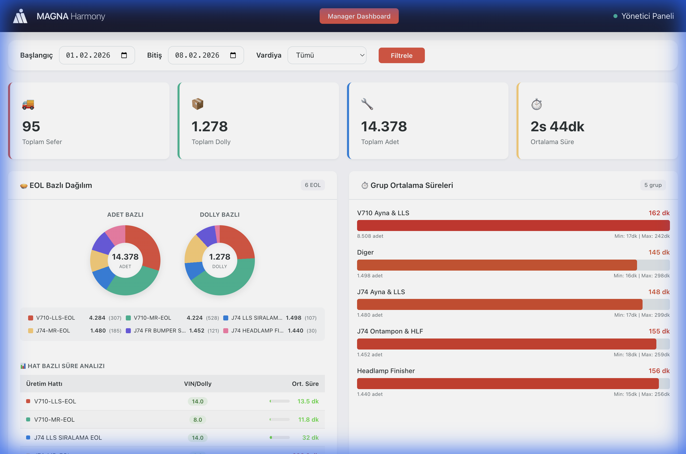

# 🏭 HarmonyView - Manager Dashboard

**Magna JIT Üretim Sevkiyat Takip ve Analiz Sistemi**

> 📅 **Son Güncelleme:** 8 Şubat 2026  
> 🏢 **Proje:** Magna Control Tower  
> 🎯 **Amaç:** JIT üretim hattından sevkiyata kadar tüm süreçlerin gerçek zamanlı takibi



---

## 📋 İçindekiler

1. [Proje Hakkında](#-proje-hakkında)
2. [İş Akışı](#-iş-akışı)
3. [Sistem Mimarisi](#-sistem-mimarisi)
4. [Veritabanı Yapısı](#-veritabanı-yapısı)
5. [SQL View'ları (Detaylı)](#-sql-viewları-detaylı)
6. [Dashboard Bileşenleri (Detaylı)](#-dashboard-bileşenleri-detaylı)
7. [Hesaplama Metodları](#-hesaplama-metodları)
8. [Backend API](#-backend-api)
9. [Frontend Teknolojileri](#-frontend-teknolojileri)
10. [Kurulum Kılavuzu](#-kurulum-kılavuzu)
11. [Servis Yönetimi](#-servis-yönetimi)
12. [Sorun Giderme](#-sorun-giderme)
13. [Geliştirici](#-geliştirici)

---

## 🎯 Proje Hakkında

### Neden Bu Proje?

Magna otomotiv fabrikasında **JIT (Just-In-Time)** üretim sistemi uygulanmaktadır. Bu sistemde:

1. **EOL (End of Line)** hatlarında parçalar dolly'lere yüklenir
2. Forklift operatörleri dolly'leri terminal noktalarına taşır
3. Veri giriş operatörleri sevkiyat bilgilerini sisteme girer
4. ASN (Advance Shipping Notification) müşteriye gönderilir

**Problem:** Bu süreçlerin takibi ve analizi manuel yapılıyordu, darboğazlar tespit edilemiyordu.

**Çözüm:** HarmonyView Manager Dashboard, tüm bu süreçleri gerçek zamanlı takip eder ve analiz eder.

### Temel Özellikler

| Özellik | Açıklama | Teknik Detay |
|---------|----------|--------------|
| 📊 **Gerçek Zamanlı Dashboard** | Anlık istatistikler | 60 sn otomatik yenileme |
| 🥧 **EOL Dağılım Grafikleri** | Hat bazlı üretim dağılımı | CSS-based donut charts |
| ⏱️ **Süre Analizleri** | Tüm süreç adımları için süre takibi | DollyEOLInfo.InsertedAt bazlı |
| 👷 **Operatör Performansı** | Bireysel performans metrikleri | Top 10 ranking |
| 🔄 **Otomatik Yenileme** | Kesintisiz veri akışı | setInterval 60000ms |
| 📅 **Gelişmiş Filtreleme** | Tarih, vardiya, minimum VIN | URL query parameters |
| 📱 **Responsive Tasarım** | Tüm ekran boyutlarında çalışır | CSS media queries |

---

## 🔄 İş Akışı

### Fiziksel Süreç Akışı

```
┌─────────────────────────────────────────────────────────────────────────────┐
│                           ÜRETİM HATTI (EOL)                                │
│  ┌─────────┐    ┌─────────┐    ┌─────────┐    ┌─────────┐    ┌─────────┐   │
│  │ VIN #1  │───►│ VIN #2  │───►│ VIN #3  │───►│  ...    │───►│ VIN #N  │   │
│  │ 08:00   │    │ 08:05   │    │ 08:10   │    │         │    │ 08:30   │   │
│  └─────────┘    └─────────┘    └─────────┘    └─────────┘    └─────────┘   │
│       │              │              │              │              │        │
│       └──────────────┴──────────────┴──────────────┴──────────────┘        │
│                                    │                                        │
│                                    ▼                                        │
│                           ┌───────────────┐                                 │
│                           │    DOLLY      │ ◄── DollyEOLInfo.InsertedAt   │
│                           │   (Dolu)      │     her VIN için kayıt         │
│                           └───────┬───────┘                                 │
└───────────────────────────────────┼─────────────────────────────────────────┘
                                    │
                                    │ Forklift Taşıma
                                    │ (EOL → Terminal)
                                    ▼
┌───────────────────────────────────────────────────────────────────────────────┐
│                         TERMİNAL NOKTASI                                      │
│  ┌─────────────────────────────────────────────┐                              │
│  │  Forklift Operatörü Barkod Okutma           │                              │
│  │  SeferDollyEOL.TerminalDate = 08:45         │ ◄── TerminalDate kaydedilir │
│  │  SeferDollyEOL.TerminalUser = 'Murat Sayin' │                              │
│  └─────────────────────────────────────────────┘                              │
└───────────────────────────────────┬───────────────────────────────────────────┘
                                    │
                                    │ Veri Giriş
                                    │ (Terminal → ASN)
                                    ▼
┌───────────────────────────────────────────────────────────────────────────────┐
│                         VERİ GİRİŞ İSTASYONU                                  │
│  ┌─────────────────────────────────────────────┐                              │
│  │  Veri Giriş Operatörü ASN Kaydı            │                              │
│  │  SeferDollyEOL.ASNDate = 09:00             │ ◄── ASNDate kaydedilir       │
│  │  SeferDollyEOL.VeriGirisUser = 'Ahmet K.'  │                              │
│  └─────────────────────────────────────────────┘                              │
└───────────────────────────────────┬───────────────────────────────────────────┘
                                    │
                                    │ Sevkiyat
                                    ▼
┌───────────────────────────────────────────────────────────────────────────────┐
│                              SEVKİYAT                                         │
│  ┌─────────────────────────────────────────────┐                              │
│  │  İrsaliye Kesilir                           │                              │
│  │  SeferDollyEOL.IrsaliyeDate = 09:15        │ ◄── Süreç tamamlanır         │
│  └─────────────────────────────────────────────┘                              │
└───────────────────────────────────────────────────────────────────────────────┘
```

### Süre Hesaplama Noktaları

| Süre | Başlangıç | Bitiş | Ne Ölçülüyor? |
|------|-----------|-------|---------------|
| **Dolly Doldurma** | İlk VIN InsertedAt | Son VIN InsertedAt | EOL hattında dolly'nin dolma süresi |
| **EOL → Terminal** | Son VIN InsertedAt | TerminalDate | Forklift taşıma süresi |
| **Terminal → ASN** | TerminalDate | ASNDate | Veri giriş süresi |
| **Toplam Süre** | Son VIN InsertedAt | ASNDate/IrsaliyeDate | Uçtan uca süreç süresi |

---

## 🏗️ Sistem Mimarisi

### Genel Mimari

```
┌─────────────────────────────────────────────────────────────────────────────┐
│                              KULLANICI KATMANI                              │
│  ┌─────────────────────────────────────────────────────────────────────┐   │
│  │                         Web Tarayıcı                                 │   │
│  │  http://10.25.64.181:5174                                           │   │
│  │  ┌──────────────┐ ┌──────────────┐ ┌──────────────┐                 │   │
│  │  │ Chrome/Edge  │ │   Firefox    │ │   Safari     │                 │   │
│  │  └──────────────┘ └──────────────┘ └──────────────┘                 │   │
│  └─────────────────────────────────────────────────────────────────────┘   │
└─────────────────────────────────────────────────────────────────────────────┘
                                    │
                                    │ HTTP/HTTPS (Port 5174)
                                    ▼
┌─────────────────────────────────────────────────────────────────────────────┐
│                           FRONTEND KATMANI                                  │
│  ┌─────────────────────────────────────────────────────────────────────┐   │
│  │                    React + Vite Dev Server                           │   │
│  │                                                                      │   │
│  │  Teknolojiler:                                                       │   │
│  │  • React 19 (Hooks: useState, useEffect, useCallback)               │   │
│  │  • Vite 7.2.5 (HMR, Fast Refresh)                                   │   │
│  │  • Pure CSS (CSS Variables, Flexbox, Grid)                          │   │
│  │  • CSS-based Charts (conic-gradient donut charts)                   │   │
│  │                                                                      │   │
│  │  Dosyalar:                                                           │   │
│  │  ├── App.jsx (831 satır) - Ana dashboard bileşeni                   │   │
│  │  ├── App.css (687 satır) - Tüm stiller ve responsive                │   │
│  │  ├── index.css (73 satır) - Global reset ve değişkenler             │   │
│  │  └── main.jsx - React entry point                                   │   │
│  └─────────────────────────────────────────────────────────────────────┘   │
└─────────────────────────────────────────────────────────────────────────────┘
                                    │
                                    │ REST API (Port 8001)
                                    │ fetch() → JSON response
                                    ▼
┌─────────────────────────────────────────────────────────────────────────────┐
│                           BACKEND KATMANI                                   │
│  ┌─────────────────────────────────────────────────────────────────────┐   │
│  │                    FastAPI + Uvicorn Server                          │   │
│  │                                                                      │   │
│  │  Teknolojiler:                                                       │   │
│  │  • Python 3.10+                                                      │   │
│  │  • FastAPI (async/await, Pydantic validation)                       │   │
│  │  • Uvicorn ASGI Server                                              │   │
│  │  • SQLAlchemy (ORM + Raw SQL)                                       │   │
│  │  • pyodbc (SQL Server driver)                                       │   │
│  │                                                                      │   │
│  │  Dosyalar:                                                           │   │
│  │  ├── app_manager.py - FastAPI routes ve CORS                        │   │
│  │  ├── database.py - Connection pool ve session                       │   │
│  │  ├── queries_dashboard.py - Tüm SQL sorguları                       │   │
│  │  └── models_dashboard.py - Pydantic response modelleri              │   │
│  │                                                                      │   │
│  │  CORS Ayarları:                                                      │   │
│  │  • allow_origins=["*"]                                              │   │
│  │  • allow_methods=["*"]                                              │   │
│  │  • allow_headers=["*"]                                              │   │
│  └─────────────────────────────────────────────────────────────────────┘   │
└─────────────────────────────────────────────────────────────────────────────┘
                                    │
                                    │ SQLAlchemy + pyodbc
                                    │ Connection String: mssql+pyodbc://
                                    ▼
┌─────────────────────────────────────────────────────────────────────────────┐
│                          VERİTABANI KATMANI                                 │
│  ┌─────────────────────────────────────────────────────────────────────┐   │
│  │                    Microsoft SQL Server 2017                         │   │
│  │                                                                      │   │
│  │  KAYNAK TABLOLAR:                                                    │   │
│  │  ┌─────────────────┐     ┌─────────────────┐                        │   │
│  │  │  SeferDollyEOL  │     │  DollyEOLInfo   │                        │   │
│  │  │  (Ana sevkiyat) │     │  (VIN zamanları) │                        │   │
│  │  └────────┬────────┘     └────────┬────────┘                        │   │
│  │           │                       │                                  │   │
│  │           └───────────┬───────────┘                                  │   │
│  │                       ▼                                              │   │
│  │  SQL VIEWS (8 adet):                                                 │   │
│  │  ┌─────────────────────────────────────────────────────────────┐    │   │
│  │  │ VW_DollyCompletion → VW_DollyProcessTimeline                │    │   │
│  │  │      ↓                      ↓                                │    │   │
│  │  │ VW_SeferSummary    VW_DailySummary    VW_GroupPerformance   │    │   │
│  │  │ VW_OperatorPerformance  VW_DataEntryPerformance             │    │   │
│  │  │ VW_PartPerformance      VW_HourlyThroughput                 │    │   │
│  │  └─────────────────────────────────────────────────────────────┘    │   │
│  └─────────────────────────────────────────────────────────────────────┘   │
└─────────────────────────────────────────────────────────────────────────────┘
```

---

## 💾 Veritabanı Yapısı

### 1. SeferDollyEOL (Ana Sevkiyat Tablosu)

Bu tablo, fabrikadaki tüm sevkiyat işlemlerinin merkezi kaynağıdır. Her bir VIN (araç) için bir kayıt içerir.

```sql
-- Örnek veri yapısı
SELECT TOP 1 * FROM SeferDollyEOL

-- Sonuç:
-- DollyNo      : 1129636
-- SeferNumarasi: 0001461590
-- PlakaNo      : 41LG781
-- VinNo        : SJNFAAJ14U1234567
-- EOLName      : V710-LLS-EOL
-- EOLID        : 15
-- PartNumber   : PART-20260206-7B0E57A3
-- Adet         : 1
-- TerminalDate : 2026-02-06 14:30:00
-- TerminalUser : Murat Sayin
-- ASNDate      : 2026-02-06 14:45:00
-- VeriGirisUser: Ahmet Kaya
-- IrsaliyeDate : 2026-02-06 15:00:00
```

| Kolon | Veri Tipi | Açıklama | Örnek |
|-------|-----------|----------|-------|
| `DollyNo` | VARCHAR(20) | Dolly benzersiz numarası | 1129636 |
| `SeferNumarasi` | VARCHAR(20) | Sevkiyat/Sefer numarası | 0001461590 |
| `PlakaNo` | VARCHAR(15) | Taşıyıcı araç plakası | 41LG781 |
| `VinNo` | VARCHAR(50) | Araç VIN numarası | SJNFAAJ14U1234567 |
| `EOLName` | VARCHAR(100) | End of Line hat ismi | V710-LLS-EOL |
| `EOLID` | INT | EOL hat ID numarası | 15 |
| `PartNumber` | VARCHAR(50) | Üretilen parça numarası | PART-20260206-7B0E57A3 |
| `Adet` | INT | Parça adedi | 1 |
| `TerminalDate` | DATETIME | Forklift terminal okutma zamanı | 2026-02-06 14:30:00 |
| `TerminalUser` | VARCHAR(100) | Forklift operatörü adı | Murat Sayin |
| `ASNDate` | DATETIME | ASN (Advance Shipping Notice) zamanı | 2026-02-06 14:45:00 |
| `VeriGirisUser` | VARCHAR(100) | Veri giriş operatörü | Ahmet Kaya |
| `IrsaliyeDate` | DATETIME | İrsaliye kesilme zamanı | 2026-02-06 15:00:00 |

---

### 2. DollyEOLInfo (VIN Zaman Tablosu)

Bu tablo, her VIN'in dolly'ye ne zaman eklendiğini kaydeder. **Üretim süresi hesaplamasının temel kaynağıdır.**

```sql
-- Örnek veri yapısı
SELECT * FROM DollyEOLInfo WHERE DollyNo = '1129636' ORDER BY InsertedAt

-- Sonuç:
-- DollyNo  | VinNo                | EOLName      | InsertedAt
-- 1129636  | SJNFAAJ14U1234567   | V710-LLS-EOL | 2026-02-06 14:00:00  ◄── İlk VIN
-- 1129636  | SJNFAAJ14U1234568   | V710-LLS-EOL | 2026-02-06 14:05:00
-- 1129636  | SJNFAAJ14U1234569   | V710-LLS-EOL | 2026-02-06 14:10:00
-- ...
-- 1129636  | SJNFAAJ14U1234580   | V710-LLS-EOL | 2026-02-06 14:25:00  ◄── Son VIN
```

| Kolon | Veri Tipi | Açıklama | Kullanım Amacı |
|-------|-----------|----------|----------------|
| `DollyNo` | VARCHAR(20) | Dolly numarası | Gruplama için |
| `VinNo` | VARCHAR(50) | VIN numarası | Benzersiz tanımlayıcı |
| `EOLName` | VARCHAR(100) | EOL hat ismi | Hat bazlı raporlama |
| `InsertedAt` | DATETIME | VIN'in dolly'ye eklenme zamanı | **SÜRE HESAPLAMA** |

---

## 📊 SQL View'ları (Detaylı)

### View Oluşturma Sırası (Dependency Order)

```
1. VW_DollyCompletion        ← Temel view (SeferDollyEOL + DollyEOLInfo)
2. VW_DollyProcessTimeline   ← Ana timeline (VW_DollyCompletion'dan türetilir)
3. VW_SeferSummary           ← Sefer özeti (VW_DollyProcessTimeline'dan)
4. VW_DailySummary           ← Günlük özet (VW_DollyProcessTimeline'dan)
5. VW_GroupPerformance       ← Grup performansı (VW_DollyProcessTimeline'dan)
6. VW_OperatorPerformance    ← Forklift performansı (VW_DollyProcessTimeline'dan)
7. VW_DataEntryPerformance   ← Veri giriş performansı (VW_DollyProcessTimeline'dan)
8. VW_PartPerformance        ← Parça performansı (VW_DollyProcessTimeline'dan)
9. VW_HourlyThroughput       ← Saatlik verim (Doğrudan SeferDollyEOL'dan)
```

---

### 📌 VIEW 1: VW_DollyCompletion

**Amaç:** Birden fazla VIN kaydına sahip dolly'leri tek satıra toplar ve temel bilgileri hesaplar.

**Neden Gerekli?** `SeferDollyEOL` tablosunda her VIN için ayrı satır vardır. Dashboard'da dolly bazında gösterim yapmak için bu kayıtların birleştirilmesi gerekir.

```sql
CREATE VIEW VW_DollyCompletion AS
SELECT 
    sde.DollyNo,
    sde.SeferNumarasi,
    sde.PlakaNo,
    
    -- Aggregations (MAX ile tek değer alınır)
    MAX(sde.EOLName) AS EOLName,
    MAX(sde.EOLID) AS EOLID,
    MAX(sde.PartNumber) AS PartNumber,
    
    -- VIN sayısı (dolly'deki farklı VIN'ler)
    COUNT(DISTINCT sde.VinNo) AS VinCount,
    
    -- Zaman hesaplamaları (DollyEOLInfo'dan)
    MIN(dei.InsertedAt) AS IlkVinZamani,    -- İlk VIN ne zaman eklendi?
    MAX(dei.InsertedAt) AS SonVinZamani,    -- Son VIN ne zaman eklendi?
    
    -- Diğer zaman damgaları (SeferDollyEOL'dan)
    MIN(sde.TerminalDate) AS TerminalOkutmaZamani,
    MIN(sde.ASNDate) AS ASN_GonderimZamani,
    MIN(sde.IrsaliyeDate) AS Irsaliye_GonderimZamani,
    
    -- Toplam adet
    SUM(ISNULL(sde.Adet, 1)) AS ToplamAdet,
    
    -- Operatörler
    MAX(sde.TerminalUser) AS ForkliftOperator,
    MAX(sde.VeriGirisUser) AS DataEntryOperator,
    
    -- Otomatik Grup Belirleme (EOL ismine göre)
    CASE 
        WHEN MAX(sde.EOLName) LIKE 'V710-LLS%' OR MAX(sde.EOLName) LIKE 'V710-MR%' 
            THEN 'V710 Ayna & LLS'
        WHEN MAX(sde.EOLName) LIKE 'J74-LLS%' OR MAX(sde.EOLName) LIKE 'J74-MR%' 
            THEN 'J74 Ayna & LLS'
        WHEN MAX(sde.EOLName) LIKE '%ONTAMPON%' OR MAX(sde.EOLName) LIKE '%HLF%' 
            OR MAX(sde.EOLName) LIKE '%BUMPER%' 
            THEN CASE 
                WHEN MAX(sde.EOLName) LIKE 'J74%' THEN 'J74 Ontampon & HLF'
                WHEN MAX(sde.EOLName) LIKE 'V710%' THEN 'V710 Ontampon'
                ELSE 'Ontampon Diğer'
            END
        WHEN MAX(sde.EOLName) LIKE '%HEADLAMP%' OR MAX(sde.EOLName) LIKE '%FINISHER%' 
            THEN 'Headlamp Finisher'
        ELSE 'Diğer'
    END AS GroupName

FROM SeferDollyEOL sde WITH (NOLOCK)
LEFT JOIN DollyEOLInfo dei WITH (NOLOCK) 
    ON sde.DollyNo = dei.DollyNo 
    AND sde.VinNo = dei.VinNo
WHERE sde.SeferNumarasi IS NOT NULL
GROUP BY sde.DollyNo, sde.SeferNumarasi, sde.PlakaNo;
```

**Çıktı Örneği:**

| DollyNo | SeferNumarasi | VinCount | IlkVinZamani | SonVinZamani | GroupName |
|---------|---------------|----------|--------------|--------------|-----------|
| 1129636 | 0001461590 | 14 | 2026-02-06 14:00 | 2026-02-06 14:25 | V710 Ayna & LLS |
| 1129635 | 0001461497 | 8 | 2026-02-06 13:30 | 2026-02-06 13:45 | V710 Ayna & LLS |

---

### 📌 VIEW 2: VW_DollyProcessTimeline

**Amaç:** Her dolly için tüm süre hesaplamalarını yapar. Dashboard'un ana veri kaynağıdır.

```sql
CREATE VIEW VW_DollyProcessTimeline AS
SELECT 
    DollyNo,
    SeferNumarasi,
    PlakaNo,
    EOLName,
    PartNumber,
    EOLID,
    GroupName,
    VinCount,
    ToplamAdet AS Adet,
    ForkliftOperator,
    DataEntryOperator,
    
    -- Zaman noktaları (rename for clarity)
    IlkVinZamani AS EOL_CikisZamani,
    SonVinZamani AS DollyHazirZamani,
    TerminalOkutmaZamani AS TerminalDate,
    ASN_GonderimZamani AS ASNDate,
    Irsaliye_GonderimZamani AS IrsaliyeDate,
    
    -- SÜRE HESAPLAMALARI
    
    -- 1. Dolly Doldurma Süresi (dk)
    -- İlk VIN ile Son VIN arasındaki fark
    ISNULL(DATEDIFF(MINUTE, IlkVinZamani, SonVinZamani), 0) AS DollyDoldurmaSuresi_Min,
    
    -- 2. EOL → Terminal Süresi (dk)
    -- Dolly hazır olduktan sonra terminale taşınma süresi
    CASE 
        WHEN SonVinZamani IS NOT NULL AND TerminalOkutmaZamani IS NOT NULL 
        THEN DATEDIFF(MINUTE, SonVinZamani, TerminalOkutmaZamani) 
        ELSE 15  -- Varsayılan değer (veri yoksa)
    END AS EOL_To_Terminal_Min,
    
    -- 3. Terminal → ASN Süresi (dk)
    -- Terminal okutmadan ASN gönderilene kadar
    CASE 
        WHEN TerminalOkutmaZamani IS NOT NULL AND ASN_GonderimZamani IS NOT NULL 
        THEN DATEDIFF(MINUTE, TerminalOkutmaZamani, ASN_GonderimZamani) 
        ELSE 10  -- Varsayılan değer
    END AS Terminal_To_ASN_Min,
    
    -- 4. TOPLAM SÜRE (dk) - Ana KPI
    -- Dolly hazır → ASN/İrsaliye
    CASE 
        WHEN SonVinZamani IS NOT NULL 
             AND (ASN_GonderimZamani IS NOT NULL OR Irsaliye_GonderimZamani IS NOT NULL) 
        THEN DATEDIFF(MINUTE, SonVinZamani, 
             COALESCE(ASN_GonderimZamani, Irsaliye_GonderimZamani))
        WHEN TerminalOkutmaZamani IS NOT NULL 
             AND (ASN_GonderimZamani IS NOT NULL OR Irsaliye_GonderimZamani IS NOT NULL)
        THEN DATEDIFF(MINUTE, TerminalOkutmaZamani, 
             COALESCE(ASN_GonderimZamani, Irsaliye_GonderimZamani)) + 15
        ELSE NULL
    END AS ToplamSure_Min,
    
    -- İşlem Tarihi (sadece tarih kısmı)
    CAST(TerminalOkutmaZamani AS DATE) AS IslemTarihi,
    
    -- Vardiya Hesaplama
    CASE 
        WHEN CAST(TerminalOkutmaZamani AS TIME) >= '08:00:00' 
             AND CAST(TerminalOkutmaZamani AS TIME) < '16:00:00' THEN 1  -- Sabah
        WHEN CAST(TerminalOkutmaZamani AS TIME) >= '16:00:00' THEN 2    -- Akşam
        ELSE 3  -- Gece
    END AS Vardiya

FROM VW_DollyCompletion
WHERE TerminalOkutmaZamani IS NOT NULL;
```

---

### 📌 VIEW 3-8: Özet View'lar

#### VW_SeferSummary (Sefer Özeti)
```sql
-- Her sefer için: Toplam dolly, VIN, adet, ortalama süre
SELECT SeferNumarasi, PlakaNo, 
       COUNT(DISTINCT DollyNo) AS ToplamDolly,
       AVG(ToplamSure_Min) AS OrtSure
FROM VW_DollyProcessTimeline
GROUP BY SeferNumarasi, PlakaNo
```

#### VW_GroupPerformance (Grup Performansı)
```sql
-- Ürün grupları için performans metrikleri
-- Dashboard'daki "Grup Ortalama Süreleri" bar chart'ı buradan beslenir
SELECT GroupName,
       COUNT(DISTINCT DollyNo) AS DollyCount,
       SUM(VinCount) AS VinCount,
       AVG(ToplamSure_Min) AS AvgDuration_Min
FROM VW_DollyProcessTimeline
GROUP BY GroupName
```

#### VW_OperatorPerformance (Forklift Operatör)
```sql
-- Top 10 Forklift Operatörleri tablosu buradan beslenir
SELECT ForkliftOperator,
       COUNT(DISTINCT SeferNumarasi) AS ToplamSefer,
       COUNT(DISTINCT DollyNo) AS ToplamDolly,
       AVG(ToplamSure_Min) AS OrtSure
FROM VW_DollyProcessTimeline
GROUP BY ForkliftOperator
```

#### VW_DataEntryPerformance (Veri Giriş Operatör)
```sql
-- Top 10 Veri Girişçileri tablosu buradan beslenir
SELECT DataEntryOperator,
       COUNT(DISTINCT DollyNo) AS ToplamDolly,
       AVG(Terminal_To_ASN_Min) AS OrtVeriGirisSuresi
FROM VW_DollyProcessTimeline
GROUP BY DataEntryOperator
```

---

## 📈 Dashboard Bileşenleri (Detaylı)

### 1. Özet Kartlar (Summary Cards)

Ekranın üst kısmındaki 4 büyük metrik kartı:

```
┌──────────────────┐ ┌──────────────────┐ ┌──────────────────┐ ┌──────────────────┐
│    🚚 95         │ │    📦 1.278      │ │    ✔ 14.378      │ │    ⏱ 2s 44dk     │
│   Toplam Sefer   │ │   Toplam Dolly   │ │   Toplam Adet    │ │   Ortalama Süre  │
└──────────────────┘ └──────────────────┘ └──────────────────┘ └──────────────────┘
```

| Kart | SQL Sorgusu | Hesaplama Detayı |
|------|-------------|------------------|
| **Toplam Sefer** | `COUNT(DISTINCT SeferNumarasi)` | Benzersiz sefer sayısı |
| **Toplam Dolly** | `COUNT(DISTINCT DollyNo)` | Benzersiz dolly sayısı |
| **Toplam Adet** | `SUM(Adet)` | Tüm parçaların toplamı |
| **Ortalama Süre** | `AVG(ToplamSure_Min)` | ToplamSure_Min ortalaması, format: `Xs Ydk` |

**Frontend Formatlama:**
```javascript
const formatDuration = (min) => {
  if (min < 60) return `${min} dk`
  const h = Math.floor(min / 60)
  const m = Math.round(min % 60)
  return `${h}s ${m}dk`
}
```

---

### 2. EOL Bazlı Dağılım (Donut Charts)

İki adet CSS-based donut chart:

```
        ADET BAZLI                     DOLLY BAZLI
     ┌────────────┐                 ┌────────────┐
     │  ┌──────┐  │                 │  ┌──────┐  │
     │  │14.378│  │                 │  │1.278 │  │
     │  │ VIN  │  │                 │  │DOLLY │  │
     │  └──────┘  │                 │  └──────┘  │
     └────────────┘                 └────────────┘
```

**SQL Sorgusu:**
```python
# queries_dashboard.py - get_eol_distribution()
SELECT TOP 15
    EOLName as eol_name,
    SUM(Adet) as total_adet,
    COUNT(DISTINCT DollyNo) as dolly_count,
    SUM(VinCount) as vin_count
FROM VW_DollyProcessTimeline
WHERE IslemTarihi BETWEEN :start_date AND :end_date
GROUP BY EOLName
ORDER BY total_adet DESC
```

**CSS Donut Chart Oluşturma:**
```javascript
// Frontend - conic-gradient ile pasta grafik
const gradientParts = slices.map(s => 
  `${s.color} ${s.startAngle/3.6}% ${s.endAngle/3.6}%`
);
const gradient = `conic-gradient(${gradientParts.join(', ')})`;

// Örnek output:
// conic-gradient(#e74c3c 0% 30%, #00b894 30% 60%, #0984e3 60% 100%)
```

---

### 3. Hat Bazlı Süre Analizi Tablosu

| Üretim Hattı | VIN/Dolly | Ort. Süre |
|--------------|-----------|-----------|
| V710-LLS-EOL | 14.0 | 13.5 dk |
| V710-MR-EOL | 8.0 | 11.8 dk |
| J74-MR-EOL | 8.0 | 288.3 dk |

**⚠️ ÖNEMLİ:** Bu tablodaki "Ort. Süre", `DollyEOLInfo.InsertedAt` zamanlarından hesaplanır!

```python
# queries_dashboard.py - get_eol_distribution() içindeki duration sorgusu
duration_query = text("""
    SELECT 
        EOLName,
        AVG(UretimSuresi) as avg_duration
    FROM (
        SELECT 
            MAX(EOLName) AS EOLName,
            DATEDIFF(MINUTE, MIN(InsertedAt), MAX(InsertedAt)) AS UretimSuresi
        FROM DollyEOLInfo WITH (NOLOCK)
        WHERE InsertedAt BETWEEN :start_date AND DATEADD(DAY, 1, :end_date)
        GROUP BY DollyNo
        HAVING COUNT(DISTINCT VinNo) > 1 
           AND DATEDIFF(MINUTE, MIN(InsertedAt), MAX(InsertedAt)) > 0
    ) sub
    GROUP BY EOLName
""")
```

**Ne Hesaplanıyor?**
- Her dolly için: `MAX(InsertedAt) - MIN(InsertedAt)`
- Bu, dolly'nin EOL hattında doldurulma süresini gösterir
- EOL bazında ortalama alınır

---

### 4. Grup Ortalama Süreleri (Horizontal Bar Chart)

```
V710 Ayna & LLS    ████████████████████████████████████████  162 dk
Diger              █████████████████████████████████████     145 dk
J74 Ayna & LLS     ████████████████████████████████████      148 dk
J74 Ontampon       ██████████████████████████████████        155 dk
Headlamp Finisher  ██████████████████████████████████████    186 dk
```

**SQL Sorgusu:**
```python
# queries_dashboard.py - get_group_performance()
SELECT 
    GroupName as group_name,
    COUNT(DISTINCT PartNumber) as part_count,
    COUNT(DISTINCT DollyNo) as dolly_count,
    COUNT(DISTINCT SeferNumarasi) as sefer_count,
    SUM(VinCount) as vin_count,
    SUM(Adet) as total_adet,
    AVG(ToplamSure_Min) as avg_duration_min,
    MIN(ToplamSure_Min) as min_duration_min,
    MAX(ToplamSure_Min) as max_duration_min
FROM VW_DollyProcessTimeline
WHERE IslemTarihi BETWEEN :start_date AND :end_date
GROUP BY GroupName
ORDER BY total_adet DESC
```

---

### 5. Operatör Tabloları

#### Forklift Operatörleri (Top 10)

| OPERATÖR | SEFER | DOLLY | ADET | ORT. SÜRE |
|----------|-------|-------|------|-----------|
| Murat Sayin | 45 | 312 | 4.284 | 162.0 dk |
| Kadir Koç | 28 | 198 | 2.640 | 155.5 dk |

**SQL Sorgusu:**
```python
SELECT TOP 10
    ForkliftOperator as operator_name,
    COUNT(DISTINCT SeferNumarasi) as sefer_count,
    COUNT(DISTINCT DollyNo) as dolly_count,
    SUM(Adet) as adet,
    AVG(ToplamSure_Min) as avg_duration_min
FROM VW_DollyProcessTimeline
WHERE IslemTarihi BETWEEN :start_date AND :end_date
  AND ForkliftOperator IS NOT NULL
GROUP BY ForkliftOperator
ORDER BY sefer_count DESC
```

---

## 🧮 Hesaplama Metodları

### Süre Tipleri ve Formülleri

```
┌─────────────────────────────────────────────────────────────────────────────┐
│                         ZAMAN ÇİZELGESİ                                     │
│                                                                             │
│  08:00       08:10       08:25       08:45       09:00       09:15         │
│    │           │           │           │           │           │           │
│    ▼           ▼           ▼           ▼           ▼           ▼           │
│  ┌───┐       ┌───┐       ┌───┐       ┌───┐       ┌───┐       ┌───┐        │
│  │VIN│       │VIN│       │VIN│       │TRM│       │ASN│       │IRS│        │
│  │ 1 │       │...│       │ N │       │   │       │   │       │   │        │
│  └───┘       └───┘       └───┘       └───┘       └───┘       └───┘        │
│    │                       │           │           │           │           │
│    │◄─────────────────────►│           │           │           │           │
│    │   DOLLY DOLDURMA      │           │           │           │           │
│    │      25 dakika        │           │           │           │           │
│                            │           │           │           │           │
│                            │◄─────────►│           │           │           │
│                            │ EOL→TERM  │           │           │           │
│                            │  20 dk    │           │           │           │
│                                        │           │           │           │
│                                        │◄─────────►│           │           │
│                                        │ TERM→ASN  │           │           │
│                                        │   15 dk   │           │           │
│                                                    │           │           │
│                            │◄──────────────────────────────────►│           │
│                            │         TOPLAM SÜRE                │           │
│                            │           50 dakika                │           │
│                                                                             │
└─────────────────────────────────────────────────────────────────────────────┘
```

| Metrik | Formül | SQL Kodu |
|--------|--------|----------|
| **Dolly Doldurma** | Son VIN - İlk VIN | `DATEDIFF(MINUTE, MIN(InsertedAt), MAX(InsertedAt))` |
| **EOL → Terminal** | Terminal Okutma - Son VIN | `DATEDIFF(MINUTE, SonVinZamani, TerminalDate)` |
| **Terminal → ASN** | ASN Gönderim - Terminal Okutma | `DATEDIFF(MINUTE, TerminalDate, ASNDate)` |
| **Toplam Süre** | ASN/İrsaliye - Son VIN | `DATEDIFF(MINUTE, SonVinZamani, COALESCE(ASNDate, IrsaliyeDate))` |

### Vardiya Hesaplama

```sql
CASE 
    WHEN CAST(TerminalDate AS TIME) >= '08:00:00' 
         AND CAST(TerminalDate AS TIME) < '16:00:00' THEN 1   -- Sabah Vardiyası
    WHEN CAST(TerminalDate AS TIME) >= '16:00:00' THEN 2      -- Akşam Vardiyası
    ELSE 3                                                     -- Gece Vardiyası
END AS Vardiya
```

| Vardiya | Saat Aralığı |
|---------|--------------|
| 1 (Sabah) | 08:00 - 16:00 |
| 2 (Akşam) | 16:00 - 24:00 |
| 3 (Gece) | 00:00 - 08:00 |

---

## 🔌 Backend API

### Ana Endpoint: GET /api/dashboard

**URL:** `http://10.25.64.181:8001/api/dashboard`

**Query Parametreleri:**

| Parametre | Tip | Zorunlu | Varsayılan | Açıklama |
|-----------|-----|---------|------------|----------|
| `start_date` | date | ✅ | - | Başlangıç tarihi (YYYY-MM-DD) |
| `end_date` | date | ✅ | - | Bitiş tarihi (YYYY-MM-DD) |
| `shift` | int | ❌ | null | Vardiya filtresi (1, 2, 3) |
| `min_vin` | int | ❌ | null | Minimum VIN sayısı filtresi |

**Örnek İstek:**
```bash
curl "http://10.25.64.181:8001/api/dashboard?start_date=2026-02-01&end_date=2026-02-08&shift=1"
```

**Response Yapısı:**
```json
{
  "summary": {
    "total_sefer": 95,
    "total_dolly": 1278,
    "total_vin": 14378,
    "total_adet": 14378,
    "avg_duration_min": 164.3,
    "min_duration_min": 15.0,
    "max_duration_min": 299.0
  },
  "group_performance": [
    {
      "group_name": "V710 Ayna & LLS",
      "part_count": 72,
      "dolly_count": 835,
      "sefer_count": 71,
      "vin_count": 835,
      "total_adet": 8508,
      "avg_duration_min": 162.0,
      "min_duration_min": 17.0,
      "max_duration_min": 242.0
    }
  ],
  "forklift_operators": [...],
  "data_entry_operators": [...],
  "eol_distribution": [
    {
      "eol_name": "V710-LLS-EOL",
      "total_adet": 4284,
      "dolly_count": 307,
      "vin_count": 4284,
      "avg_duration_min": 13.5
    }
  ],
  "dolly_details": [...]
}
```

### Diğer Endpoint'ler

| Endpoint | Method | Açıklama |
|----------|--------|----------|
| `/health` | GET | Sistem sağlık kontrolü |
| `/api/sefer/{id}` | GET | Belirli bir seferin detayları |
| `/api/hourly` | GET | Saatlik verim grafiği verileri |

---

## 💻 Frontend Teknolojileri

### React Bileşen Yapısı

```javascript
// App.jsx - Ana bileşen
function App() {
  // State yönetimi
  const [loading, setLoading] = useState(true)
  const [error, setError] = useState(null)
  const [data, setData] = useState(null)
  const [startDate, setStartDate] = useState(...)
  const [endDate, setEndDate] = useState(...)
  const [shift, setShift] = useState('')
  const [hoveredSlice, setHoveredSlice] = useState(null)
  
  // Veri çekme
  const fetchData = useCallback(async () => {
    const res = await fetch(`${API_URL}/api/dashboard?${params}`)
    const json = await res.json()
    setData(json)
  }, [startDate, endDate, shift])
  
  // Otomatik yenileme
  useEffect(() => {
    fetchData()
    const interval = setInterval(fetchData, 60000)
    return () => clearInterval(interval)
  }, [fetchData])
  
  return (
    <div className="app">
      <header>...</header>
      <main className="main-content">
        <Filters />
        <SummaryCards />
        <DashboardGrid>
          <EOLDistribution />
          <GroupPerformance />
          <OperatorTables />
        </DashboardGrid>
      </main>
    </div>
  )
}
```

### CSS Değişkenleri (Design Tokens)

```css
:root {
  /* Renkler */
  --color-primary: #e74c3c;
  --color-success: #00b894;
  --color-warning: #fdcb6e;
  --color-danger: #d63031;
  
  /* Spacing */
  --spacing-xs: 4px;
  --spacing-sm: 8px;
  --spacing-md: 16px;
  --spacing-lg: 24px;
  
  /* Radius */
  --radius-sm: 6px;
  --radius-md: 10px;
  --radius-lg: 16px;
}
```

### Responsive Breakpoints

| Breakpoint | Değişiklikler |
|------------|---------------|
| `≤1400px` | Max-width kaldırılır, padding azalır |
| `≤1200px` | Kartlar full-width, stats 2 sütun |
| `≤992px` | Filtreler dikey, formlar full-width |
| `≤768px` | Stats tek sütun, font boyutları küçülür |
| `≤480px` | Mobil optimizasyonlar |

---

## 🚀 Kurulum Kılavuzu

### Sistem Gereksinimleri

| Bileşen | Minimum Versiyon |
|---------|------------------|
| Python | 3.10+ |
| Node.js | 18+ |
| SQL Server | 2017+ |
| ODBC Driver | 17+ |

### 1. Backend Kurulumu

```bash
# Dizine git
cd /home/sua_it_ai/controltower/harmonyview/backend

# Python bağımlılıklarını yükle
pip install -r requirements.txt

# requirements.txt içeriği:
# fastapi==0.109.0
# uvicorn==0.27.0
# sqlalchemy==2.0.25
# pyodbc==5.0.1
# pydantic==2.5.3

# SQL View'ları oluştur
# SQL Server Management Studio'da çalıştır:
# sql/views_duration_analysis.sql

# Environment dosyasını oluştur
cat > .env << EOF
DB_SERVER=your-server
DB_NAME=your-database
DB_USER=your-user
DB_PASSWORD=your-password
EOF

# Test et
python -c "from database import test_connection; print(test_connection())"

# Sunucuyu başlat
python app_manager.py
```

### 2. Frontend Kurulumu

```bash
# Dizine git
cd /home/sua_it_ai/controltower/harmonyview/frontend-manager

# Node.js bağımlılıklarını yükle
npm install

# Environment dosyasını oluştur
echo "VITE_MANAGER_API_URL=http://10.25.64.181:8001" > .env

# Development server başlat
npm run dev -- --host 0.0.0.0
```

---

## ⚙️ Servis Yönetimi

### Servis Dosyaları

**Backend Service:** `/etc/systemd/system/harmonyview-backend.service`
```ini
[Unit]
Description=HarmonyView Manager Backend API
After=network.target

[Service]
Type=simple
User=sua_it_ai
WorkingDirectory=/home/sua_it_ai/controltower/harmonyview/backend
ExecStart=/usr/bin/python3 app_manager.py
Restart=always
RestartSec=5

[Install]
WantedBy=multi-user.target
```

**Frontend Service:** `/etc/systemd/system/harmonyview-frontend.service`
```ini
[Unit]
Description=HarmonyView Manager Frontend
After=network.target

[Service]
Type=simple
User=sua_it_ai
Group=sua_it_ai
WorkingDirectory=/home/sua_it_ai/controltower/harmonyview/frontend-manager
Environment="HOME=/home/sua_it_ai"
Environment="NODE_ENV=development"
ExecStart=/usr/bin/npm run dev -- --host 0.0.0.0
Restart=always
RestartSec=5

[Install]
WantedBy=multi-user.target
```

### Servis Komutları

```bash
# Servisleri başlat
sudo systemctl start harmonyview-backend
sudo systemctl start harmonyview-frontend

# Servisleri durdur
sudo systemctl stop harmonyview-backend
sudo systemctl stop harmonyview-frontend

# Servisleri yeniden başlat
sudo systemctl restart harmonyview-backend
sudo systemctl restart harmonyview-frontend

# Servis durumunu kontrol et
sudo systemctl status harmonyview-backend
sudo systemctl status harmonyview-frontend

# Logları görüntüle
journalctl -u harmonyview-backend -f
journalctl -u harmonyview-frontend -f

# Sistem başlangıcında otomatik başlat
sudo systemctl enable harmonyview-backend
sudo systemctl enable harmonyview-frontend
```

---

## 🔧 Sorun Giderme

### Sık Karşılaşılan Sorunlar

#### 1. Backend başlamıyor

```bash
# Log kontrol et
journalctl -u harmonyview-backend -n 50

# Veritabanı bağlantısını test et
cd /home/sua_it_ai/controltower/harmonyview/backend
python -c "from database import test_connection; print(test_connection())"
```

#### 2. Frontend beyaz ekran gösteriyor

```bash
# Frontend loglarını kontrol et
journalctl -u harmonyview-frontend -n 50

# API erişimini test et
curl "http://10.25.64.181:8001/api/dashboard?start_date=2026-02-01&end_date=2026-02-08"
```

#### 3. CORS hatası alınıyor

`app_manager.py` dosyasında CORS ayarlarını kontrol et:
```python
app.add_middleware(
    CORSMiddleware,
    allow_origins=["*"],
    allow_credentials=False,
    allow_methods=["*"],
    allow_headers=["*"],
    expose_headers=["*"],
)
```

#### 4. SQL View'lar bulunamıyor

SQL Server üzerinde view'ların oluşturulduğunu kontrol et:
```sql
SELECT name FROM sys.views WHERE name LIKE 'VW_%'
```

---

## 📁 Dosya Yapısı

```
harmonyview/
│
├── backend/
│   ├── app_manager.py          # FastAPI uygulaması (228 satır)
│   ├── database.py             # Veritabanı bağlantısı
│   ├── models_dashboard.py     # Pydantic modelleri
│   ├── queries_dashboard.py    # SQL sorguları (493 satır)
│   ├── requirements.txt        # Python bağımlılıkları
│   ├── .env                    # Veritabanı credentials
│   └── sql/
│       └── views_duration_analysis.sql  # SQL View tanımları (269 satır)
│
├── frontend-manager/
│   ├── src/
│   │   ├── App.jsx             # Ana React bileşeni (829 satır)
│   │   ├── App.css             # Stiller (687 satır)
│   │   ├── index.css           # Global stiller (73 satır)
│   │   └── main.jsx            # Entry point
│   ├── package.json            # Node.js bağımlılıkları
│   ├── vite.config.js          # Vite yapılandırması
│   └── .env                    # API URL
│
├── docs/
│   └── dashboard_screenshot.png  # Ekran görüntüsü
│
├── harmonyview-backend.service   # Systemd backend servisi
├── harmonyview-frontend.service  # Systemd frontend servisi
│
└── README.md                     # Bu dosya
```

---

## 📜 Sürüm Geçmişi

| Versiyon | Tarih | Değişiklikler |
|----------|-------|---------------|
| **v2.1.0** | 2026-02-08 | Responsive tasarım, systemd servisleri, detaylı README |
| **v2.0.0** | 2026-02-08 | Dashboard yeniden tasarım, SQL Views, CSS-based charts |
| **v1.5.0** | 2026-02-07 | EOL süre analizi, interaktif tooltip'ler |
| **v1.0.0** | 2026-02-01 | İlk sürüm |

---

## 👨‍💻 Geliştirici

<div align="center">

---

### **Efekan Nefesoglu**

**Magna IT - Control Tower Projesi**

📅 Şubat 2026

---

*Bu proje, Magna otomotiv fabrikasının JIT üretim süreçlerinin*  
*daha verimli yönetilmesi için geliştirilmiştir.*

---

</div>

<div align="center">
  <sub>Built with ❤️ for Magna JIT Operations</sub>
</div>
